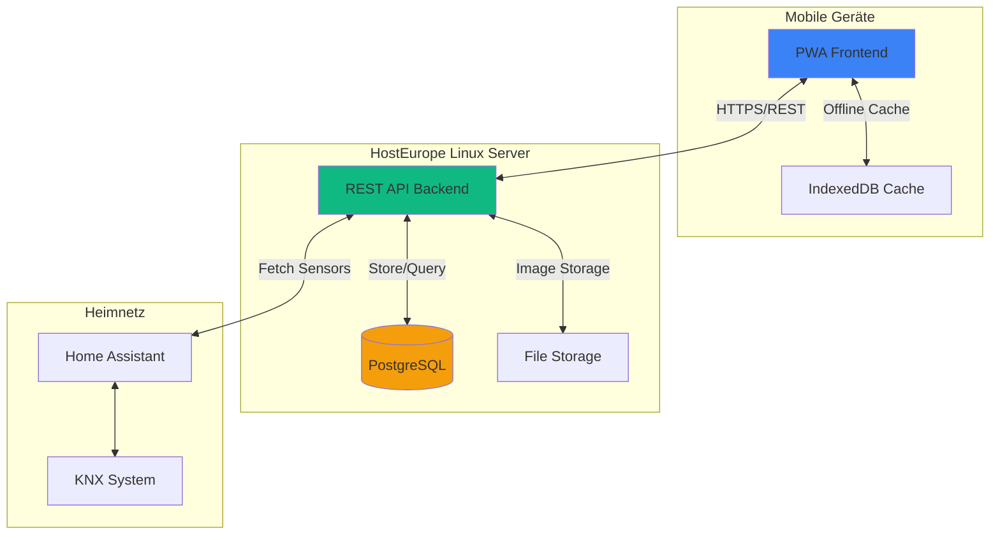
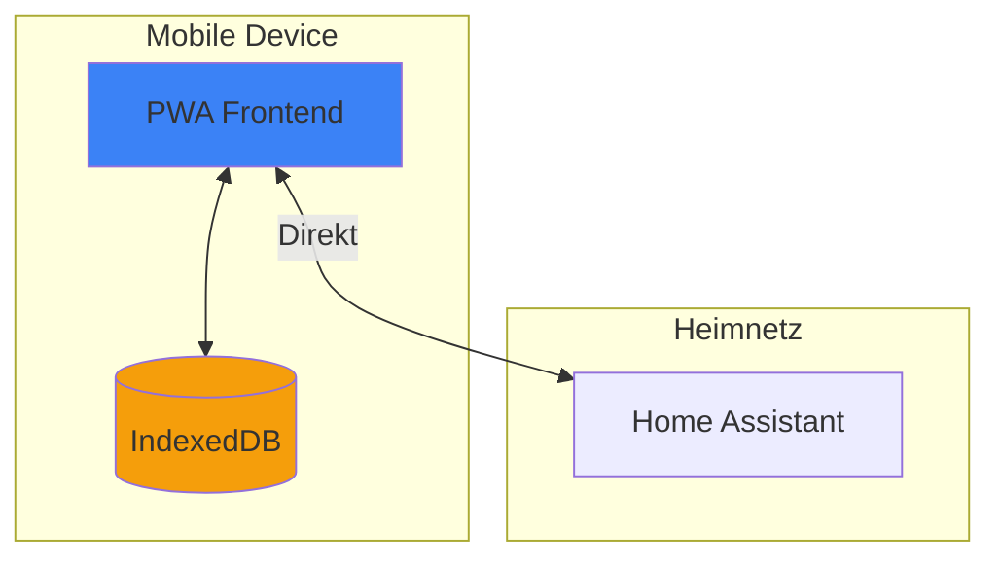
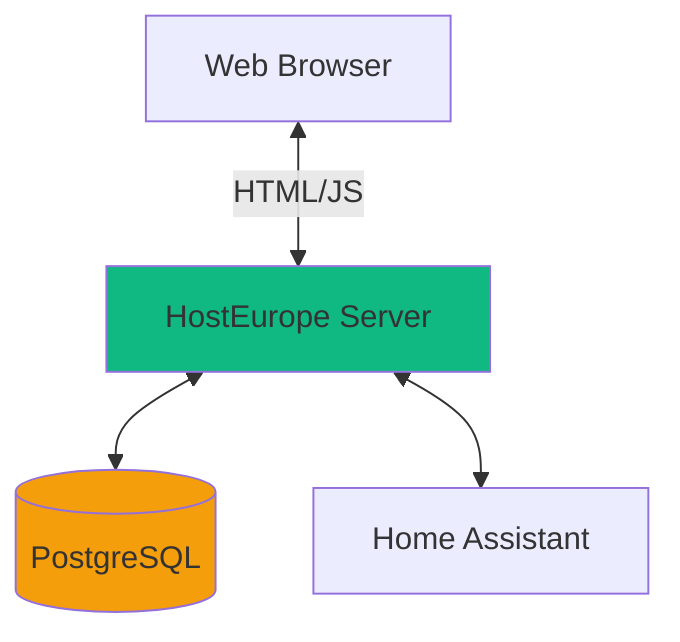
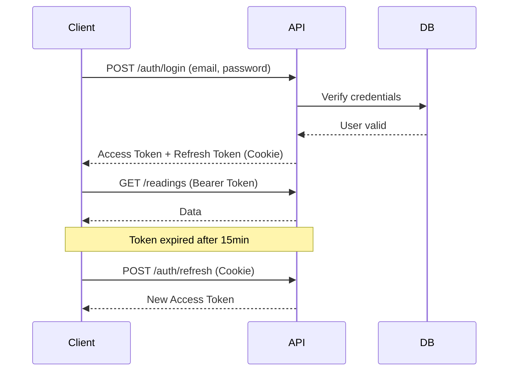
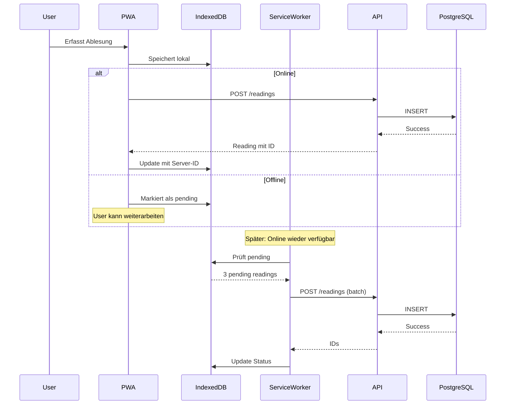
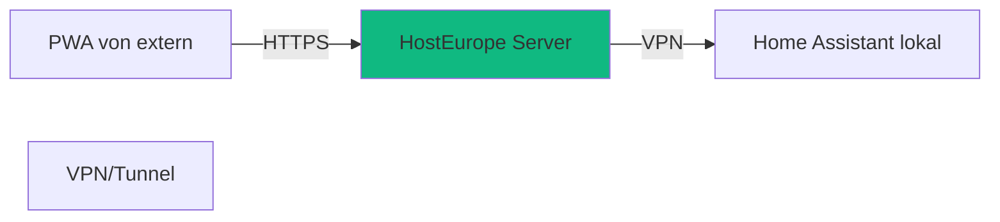

# HausTracker - Architektur-Optionen mit eigenem Server

## 🖥️ Gegebene Infrastruktur

- **Linux Server** bei HostEurope (online erreichbar)
- **Home Assistant** (vermutlich lokal im Heimnetz)
- **KNX-System** (über Home Assistant)

---

## 📊 Architektur-Varianten

### Option 1: Hybrid (Client + Server Backend) ⭐ **EMPFOHLEN**



#### ✅ Vorteile
- **Multi-Device-Sync**: Alle Geräte (Handy, Tablet, Desktop) greifen auf gleiche Daten zu
- **Zentrale Backups**: Datenbank auf Server, regelmäßige Backups
- **Offline-First**: PWA cached Daten lokal, sync bei Verbindung
- **Skalierbar**: Weitere Features einfach erweiterbar
- **Sicher**: Zentrale Authentifizierung, Zugriffskontrolle
- **Historie unbegrenzt**: Server-DB kann beliebig viele Daten speichern
- **Foto-Archiv**: Optional Zähler-Fotos auf Server speichern
- **Externe Zugriffe**: Von überall erreichbar (nicht nur im Heimnetz)

#### ⚠️ Nachteile
- **Komplexer**: Backend-Entwicklung nötig
- **Wartung**: Server muss gewartet werden
- **Kosten**: Server-Kosten (aber schon vorhanden!)

#### 🛠️ Tech Stack
```
Frontend: React PWA (wie geplant)
Backend:  Node.js + Express (oder FastAPI/Python)
Database: PostgreSQL (robust, gut für Zeitreihen)
Storage:  Lokal auf Server (Fotos optional)
Auth:     JWT + Refresh Tokens
Hosting:  Nginx Reverse Proxy auf HostEurope Server
```

---

### Option 2: Rein Client-seitig (Nur IndexedDB)



#### ✅ Vorteile
- **Einfachste Variante**: Keine Backend-Entwicklung
- **Maximale Privacy**: Daten bleiben auf Gerät
- **Schnell zu entwickeln**: Fokus auf Frontend

#### ⚠️ Nachteile
- **Single-Device**: Jedes Gerät hat eigene Daten
- **Kein Backup**: Daten verloren bei Gerätewechsel
- **Browser-Limit**: IndexedDB kann gelöscht werden (Browser-Bereinigung)
- **Keine Sync**: Verschiedene Geräte = verschiedene Stände
- **HA-Integration komplex**: Direkter Zugriff von extern schwierig

#### Fazit
❌ **Nicht empfohlen** bei vorhandenem Server

---

### Option 3: Vollständig Server-basiert (klassische Web-App)



#### ✅ Vorteile
- **Klassisch bewährt**: Standard Web-App
- **Zentrale Logik**: Alles auf Server

#### ⚠️ Nachteile
- **Kein Offline**: Funktioniert nicht ohne Internet
- **Keine PWA**: Keine Installation, kein App-Feeling
- **Performance**: Jede Aktion = Server-Request

#### Fazit
❌ **Nicht empfohlen** - PWA-Vorteile gehen verloren

---

## 🏆 Empfehlung: Option 1 (Hybrid)

### Detaillierte Architektur

```mermaid
graph TB
    subgraph "Client Layer"
        PWA[React PWA]
        SW[Service Worker]
        Cache[(IndexedDB Cache)]
    end

    subgraph "API Layer - HostEurope Server"
        NGINX[Nginx Reverse Proxy]
        API[Node.js API]
        AUTH[Auth Service]
    end

    subgraph "Data Layer - HostEurope Server"
        PG[(PostgreSQL)]
        Files[/var/www/uploads]
        Redis[(Redis Cache)]
    end

    subgraph "External Services"
        HA[Home Assistant API]
    end

    PWA <-->|HTTPS| NGINX
    NGINX --> API
    API --> AUTH
    API <--> PG
    API <--> Files
    API <--> Redis
    API <-->|Proxy| HA
    PWA <-->|Offline| Cache
    SW -->|Background Sync| API

    style API fill:#10B981
    style PWA fill:#3B82F6
    style PG fill:#F59E0B
```

---

## 💾 Datenbank-Schema (PostgreSQL)

```sql
-- Users Tabelle (für zukünftige Multi-User-Unterstützung)
CREATE TABLE users (
    id UUID PRIMARY KEY DEFAULT gen_random_uuid(),
    email VARCHAR(255) UNIQUE NOT NULL,
    password_hash VARCHAR(255) NOT NULL,
    created_at TIMESTAMP DEFAULT NOW(),
    updated_at TIMESTAMP DEFAULT NOW()
);

-- Readings Tabelle
CREATE TABLE readings (
    id UUID PRIMARY KEY DEFAULT gen_random_uuid(),
    user_id UUID REFERENCES users(id) ON DELETE CASCADE,

    -- Hauptdaten
    timestamp TIMESTAMP NOT NULL,
    meter_value DECIMAL(10, 3) NOT NULL,
    unit VARCHAR(10) DEFAULT 'MWh',

    -- Automatisch erfasste Umgebungsdaten
    outdoor_temp_current DECIMAL(5, 2),
    outdoor_temp_night_avg DECIMAL(5, 2),
    weather_condition VARCHAR(20),
    brightness_avg DECIMAL(8, 2),

    -- Berechnete Werte
    consumption DECIMAL(10, 3),
    days_since_last_reading INTEGER,

    -- Meta-Informationen
    source VARCHAR(20) DEFAULT 'manual',  -- 'ocr' | 'manual'
    ocr_confidence DECIMAL(5, 4),
    notes TEXT,
    image_path VARCHAR(500),

    -- Sync-Status
    synced_to_ha BOOLEAN DEFAULT FALSE,
    synced_at TIMESTAMP,

    created_at TIMESTAMP DEFAULT NOW(),
    updated_at TIMESTAMP DEFAULT NOW()
);

-- Home Assistant Sync Log
CREATE TABLE ha_sync_log (
    id UUID PRIMARY KEY DEFAULT gen_random_uuid(),
    reading_id UUID REFERENCES readings(id) ON DELETE CASCADE,
    entity_id VARCHAR(255),
    success BOOLEAN,
    error_message TEXT,
    synced_at TIMESTAMP DEFAULT NOW()
);

-- Settings Tabelle
CREATE TABLE settings (
    user_id UUID PRIMARY KEY REFERENCES users(id) ON DELETE CASCADE,

    -- Home Assistant Config
    ha_url VARCHAR(500),
    ha_token TEXT,
    ha_temp_entity VARCHAR(255),
    ha_brightness_entity VARCHAR(255),

    -- Reminder Config
    reminder_enabled BOOLEAN DEFAULT TRUE,
    reminder_interval_days INTEGER DEFAULT 7,

    -- Pricing
    price_per_mwh DECIMAL(8, 2),
    target_consumption_monthly DECIMAL(10, 3),

    updated_at TIMESTAMP DEFAULT NOW()
);

-- Indizes für Performance
CREATE INDEX idx_readings_user_timestamp ON readings(user_id, timestamp DESC);
CREATE INDEX idx_readings_timestamp ON readings(timestamp);
CREATE INDEX idx_ha_sync_reading ON ha_sync_log(reading_id);
```

---

## 🔌 Backend-API-Endpoints

### Authentifizierung
```
POST   /api/auth/register          # Registrierung (später)
POST   /api/auth/login             # Login (JWT Token)
POST   /api/auth/refresh           # Token erneuern
POST   /api/auth/logout            # Logout
```

### Readings
```
GET    /api/readings               # Liste aller Ablesungen (paginiert)
GET    /api/readings/:id           # Einzelne Ablesung
POST   /api/readings               # Neue Ablesung erstellen
PUT    /api/readings/:id           # Ablesung bearbeiten
DELETE /api/readings/:id           # Ablesung löschen
GET    /api/readings/stats         # Statistiken (Verbrauch, Trends)
POST   /api/readings/:id/image     # Foto hochladen (optional)
```

### Home Assistant Proxy
```
GET    /api/ha/sensors             # Verfügbare Sensoren abrufen
GET    /api/ha/sensor/:entity      # Sensor-State abrufen
GET    /api/ha/history/:entity     # Historische Daten
POST   /api/ha/sync/:readingId     # Ablesung zu HA senden
```

### Settings
```
GET    /api/settings               # User-Settings abrufen
PUT    /api/settings               # Settings aktualisieren
POST   /api/settings/ha/test       # HA-Verbindung testen
```

### Export
```
GET    /api/export/csv             # CSV-Export
GET    /api/export/excel           # Excel-Export
GET    /api/export/pdf             # PDF-Bericht
```

---

## 🔐 Sicherheitskonzept

### 1. Authentifizierung

**JWT-basiert:**
```typescript
// Access Token: Short-lived (15min)
{
  "userId": "uuid",
  "email": "user@example.com",
  "iat": 1234567890,
  "exp": 1234568790
}

// Refresh Token: Long-lived (30 Tage), HttpOnly Cookie
```

**Login-Flow:**


### 2. HTTPS & SSL

```nginx
# nginx config
server {
    listen 443 ssl http2;
    server_name haustracker.yourdomain.de;

    ssl_certificate /etc/letsencrypt/live/haustracker.yourdomain.de/fullchain.pem;
    ssl_certificate_key /etc/letsencrypt/live/haustracker.yourdomain.de/privkey.pem;

    ssl_protocols TLSv1.2 TLSv1.3;
    ssl_ciphers HIGH:!aNULL:!MD5;

    location / {
        root /var/www/haustracker;
        try_files $uri $uri/ /index.html;
    }

    location /api {
        proxy_pass http://localhost:3000;
        proxy_set_header Host $host;
        proxy_set_header X-Real-IP $remote_addr;
    }
}
```

### 3. Rate Limiting

```javascript
// Express Rate Limiter
import rateLimit from 'express-rate-limit';

const apiLimiter = rateLimit({
  windowMs: 15 * 60 * 1000, // 15 Minuten
  max: 100, // max 100 Requests
  message: 'Zu viele Anfragen, bitte später erneut versuchen.'
});

app.use('/api/', apiLimiter);
```

### 4. Home Assistant Token Storage

**Verschlüsselt in DB speichern:**
```typescript
import crypto from 'crypto';

const algorithm = 'aes-256-gcm';
const key = process.env.ENCRYPTION_KEY; // 32 bytes

function encrypt(text: string): string {
  const iv = crypto.randomBytes(16);
  const cipher = crypto.createCipheriv(algorithm, key, iv);
  let encrypted = cipher.update(text, 'utf8', 'hex');
  encrypted += cipher.final('hex');
  const authTag = cipher.getAuthTag();
  return `${iv.toString('hex')}:${authTag.toString('hex')}:${encrypted}`;
}

function decrypt(encrypted: string): string {
  const [ivHex, authTagHex, encryptedText] = encrypted.split(':');
  const iv = Buffer.from(ivHex, 'hex');
  const authTag = Buffer.from(authTagHex, 'hex');
  const decipher = crypto.createDecipheriv(algorithm, key, iv);
  decipher.setAuthTag(authTag);
  let decrypted = decipher.update(encryptedText, 'hex', 'utf8');
  decrypted += decipher.final('utf8');
  return decrypted;
}
```

---

## 🔄 Offline-First Strategie

### Service Worker Sync

```typescript
// Service Worker: Background Sync
self.addEventListener('sync', async (event) => {
  if (event.tag === 'sync-readings') {
    event.waitUntil(syncPendingReadings());
  }
});

async function syncPendingReadings() {
  const db = await openDB('haustracker');
  const pendingReadings = await db.getAll('pending_readings');

  for (const reading of pendingReadings) {
    try {
      const response = await fetch('/api/readings', {
        method: 'POST',
        headers: {
          'Authorization': `Bearer ${accessToken}`,
          'Content-Type': 'application/json'
        },
        body: JSON.stringify(reading)
      });

      if (response.ok) {
        await db.delete('pending_readings', reading.id);
        await db.put('readings', await response.json());
      }
    } catch (error) {
      console.error('Sync failed:', error);
    }
  }
}
```

### Datenfluss



---

## 🏠 Home Assistant Integration (mit Server als Proxy)

### Warum Proxy über Server?

**Problem:** Home Assistant läuft lokal, PWA von extern nicht direkt erreichbar

**Lösung:** Server fungiert als sicherer Proxy



### Möglichkeiten für HA-Zugriff vom Server

#### Option A: VPN (WireGuard)

**Setup:**
1. WireGuard Server im Heimnetz
2. HostEurope Server als VPN-Client
3. Server kann auf lokale HA-IP zugreifen

```bash
# WireGuard Config auf HostEurope Server
[Interface]
PrivateKey = SERVER_PRIVATE_KEY
Address = 10.0.0.2/24

[Peer]
PublicKey = HOME_NETWORK_PUBLIC_KEY
Endpoint = home.dyndns.org:51820
AllowedIPs = 192.168.1.0/24  # Heimnetz
PersistentKeepalive = 25
```

#### Option B: Cloudflare Tunnel (einfacher!)

**Setup:**
1. Cloudflare Tunnel auf HA-System installieren
2. Tunnel exposed nur für Server-IP
3. Server greift über Tunnel-URL zu

```bash
# Auf HA-System (z.B. als Add-on)
cloudflared tunnel create ha-tunnel
cloudflared tunnel route dns ha-tunnel ha-internal.yourdomain.de
```

#### Option C: SSH Tunnel

```bash
# Auto-SSH auf HostEurope Server
autossh -M 0 -f -N -L 8123:localhost:8123 user@home-ip
```

### API-Proxy-Implementierung

```typescript
// backend/src/routes/ha.ts
import express from 'express';
import axios from 'axios';

const router = express.Router();

router.get('/sensor/:entity', async (req, res) => {
  const { entity } = req.params;
  const { ha_url, ha_token } = await getUserSettings(req.userId);

  try {
    const response = await axios.get(
      `${ha_url}/api/states/${entity}`,
      {
        headers: { 'Authorization': `Bearer ${ha_token}` }
      }
    );
    res.json(response.data);
  } catch (error) {
    res.status(500).json({ error: 'HA request failed' });
  }
});

router.get('/history/:entity', async (req, res) => {
  const { entity } = req.params;
  const { start, end } = req.query;
  const { ha_url, ha_token } = await getUserSettings(req.userId);

  try {
    const response = await axios.get(
      `${ha_url}/api/history/period/${start}`,
      {
        params: { filter_entity_id: entity, end_time: end },
        headers: { 'Authorization': `Bearer ${ha_token}` }
      }
    );
    res.json(response.data);
  } catch (error) {
    res.status(500).json({ error: 'HA history request failed' });
  }
});

export default router;
```

---

## 📦 Deployment auf HostEurope Server

### 1. Server-Setup

```bash
# 1. System aktualisieren
sudo apt update && sudo apt upgrade -y

# 2. Node.js installieren (via nvm)
curl -o- https://raw.githubusercontent.com/nvm-sh/nvm/v0.39.0/install.sh | bash
nvm install 20
nvm use 20

# 3. PostgreSQL installieren
sudo apt install postgresql postgresql-contrib -y
sudo systemctl start postgresql
sudo systemctl enable postgresql

# 4. Nginx installieren
sudo apt install nginx -y
sudo systemctl start nginx
sudo systemctl enable nginx

# 5. Redis installieren (optional, für Caching)
sudo apt install redis-server -y

# 6. Certbot für SSL
sudo apt install certbot python3-certbot-nginx -y
```

### 2. PostgreSQL Setup

```bash
# Datenbank & User erstellen
sudo -u postgres psql

CREATE DATABASE haustracker;
CREATE USER haustracker_user WITH PASSWORD 'secure_password';
GRANT ALL PRIVILEGES ON DATABASE haustracker TO haustracker_user;
\q
```

### 3. Projekt-Struktur auf Server

```
/var/www/haustracker/
├── frontend/          # React Build (dist)
│   ├── index.html
│   ├── assets/
│   └── ...
├── backend/           # Node.js API
│   ├── src/
│   ├── package.json
│   ├── .env
│   └── ...
├── uploads/           # Zähler-Fotos (optional)
└── scripts/
    └── backup.sh      # DB Backup Script
```

### 4. Backend als Service (systemd)

```ini
# /etc/systemd/system/haustracker-api.service
[Unit]
Description=HausTracker API
After=network.target postgresql.service

[Service]
Type=simple
User=www-data
WorkingDirectory=/var/www/haustracker/backend
Environment=NODE_ENV=production
ExecStart=/home/user/.nvm/versions/node/v20.0.0/bin/node dist/index.js
Restart=on-failure

[Install]
WantedBy=multi-user.target
```

```bash
sudo systemctl daemon-reload
sudo systemctl start haustracker-api
sudo systemctl enable haustracker-api
```

### 5. Nginx Config

```nginx
# /etc/nginx/sites-available/haustracker
server {
    listen 80;
    server_name haustracker.yourdomain.de;
    return 301 https://$server_name$request_uri;
}

server {
    listen 443 ssl http2;
    server_name haustracker.yourdomain.de;

    ssl_certificate /etc/letsencrypt/live/haustracker.yourdomain.de/fullchain.pem;
    ssl_certificate_key /etc/letsencrypt/live/haustracker.yourdomain.de/privkey.pem;

    # Security Headers
    add_header Strict-Transport-Security "max-age=31536000" always;
    add_header X-Frame-Options "SAMEORIGIN" always;
    add_header X-Content-Type-Options "nosniff" always;

    # PWA Frontend
    location / {
        root /var/www/haustracker/frontend;
        try_files $uri $uri/ /index.html;

        # PWA Caching Headers
        location ~* \.(js|css|png|jpg|jpeg|gif|ico|svg|woff2)$ {
            expires 1y;
            add_header Cache-Control "public, immutable";
        }
    }

    # API Backend
    location /api {
        proxy_pass http://localhost:3000;
        proxy_http_version 1.1;
        proxy_set_header Upgrade $http_upgrade;
        proxy_set_header Connection 'upgrade';
        proxy_set_header Host $host;
        proxy_set_header X-Real-IP $remote_addr;
        proxy_set_header X-Forwarded-For $proxy_add_x_forwarded_for;
        proxy_set_header X-Forwarded-Proto $scheme;
        proxy_cache_bypass $http_upgrade;
    }

    # Uploaded Images
    location /uploads {
        alias /var/www/haustracker/uploads;
        expires 1y;
        add_header Cache-Control "public";
    }
}
```

```bash
sudo ln -s /etc/nginx/sites-available/haustracker /etc/nginx/sites-enabled/
sudo nginx -t
sudo systemctl reload nginx
```

### 6. SSL-Zertifikat

```bash
sudo certbot --nginx -d haustracker.yourdomain.de
```

### 7. Automatische Backups

```bash
# /var/www/haustracker/scripts/backup.sh
#!/bin/bash
BACKUP_DIR="/var/backups/haustracker"
DATE=$(date +%Y%m%d_%H%M%S)

# PostgreSQL Backup
pg_dump -U haustracker_user haustracker | gzip > "$BACKUP_DIR/db_$DATE.sql.gz"

# Uploads Backup
tar -czf "$BACKUP_DIR/uploads_$DATE.tar.gz" /var/www/haustracker/uploads/

# Alte Backups löschen (älter als 30 Tage)
find "$BACKUP_DIR" -type f -mtime +30 -delete
```

```bash
# Cron Job (täglich um 3 Uhr)
sudo crontab -e
0 3 * * * /var/www/haustracker/scripts/backup.sh
```

---

## 🚀 CI/CD Pipeline (optional, aber empfohlen)

### GitHub Actions Workflow

```yaml
# .github/workflows/deploy.yml
name: Deploy to HostEurope

on:
  push:
    branches: [ main ]

jobs:
  deploy:
    runs-on: ubuntu-latest
    steps:
      - uses: actions/checkout@v3

      - name: Setup Node.js
        uses: actions/setup-node@v3
        with:
          node-version: '20'

      # Frontend Build
      - name: Build Frontend
        run: |
          cd frontend
          npm ci
          npm run build

      # Backend Build
      - name: Build Backend
        run: |
          cd backend
          npm ci
          npm run build

      # Deploy via SSH
      - name: Deploy to Server
        uses: easingthemes/ssh-deploy@main
        env:
          SSH_PRIVATE_KEY: ${{ secrets.SSH_PRIVATE_KEY }}
          REMOTE_HOST: ${{ secrets.REMOTE_HOST }}
          REMOTE_USER: ${{ secrets.REMOTE_USER }}
          SOURCE: "frontend/dist/ backend/dist/"
          TARGET: "/var/www/haustracker/"

      - name: Restart Backend Service
        uses: appleboy/ssh-action@master
        with:
          host: ${{ secrets.REMOTE_HOST }}
          username: ${{ secrets.REMOTE_USER }}
          key: ${{ secrets.SSH_PRIVATE_KEY }}
          script: |
            sudo systemctl restart haustracker-api
```

---

## 📊 Vergleich: Mit vs. Ohne Server

| Aspekt | Ohne Server (IndexedDB) | Mit Server (Hybrid) |
|--------|-------------------------|---------------------|
| **Multi-Device** | ❌ Nein | ✅ Ja |
| **Backup** | ❌ Manuell | ✅ Automatisch |
| **Datenverlust-Risiko** | ⚠️ Hoch | ✅ Niedrig |
| **Offline** | ✅ Ja | ✅ Ja (Cache) |
| **Historie** | ⚠️ Browser-Limit | ✅ Unbegrenzt |
| **HA-Integration** | ⚠️ Nur lokal | ✅ Von überall |
| **Foto-Archiv** | ❌ Schwierig | ✅ Einfach |
| **Komplexität** | ✅ Einfach | ⚠️ Höher |
| **Entwicklungszeit** | ✅ 3 Wochen | ⚠️ 5-6 Wochen |
| **Wartung** | ✅ Keine | ⚠️ Server |
| **Erweiterbarkeit** | ⚠️ Limitiert | ✅ Sehr gut |

---

## 💡 Finale Empfehlung

Bei **vorhandenem Server** → **definitiv Hybrid-Architektur**!

### Entwicklungs-Phasen angepasst:

**Phase 1: Frontend MVP** (2 Wochen)
- PWA mit lokalem IndexedDB
- OCR-Funktionalität
- Basis-UI
→ Schnell testbar, unabhängig von Backend

**Phase 2: Backend & API** (2 Wochen)
- Node.js API
- PostgreSQL Setup
- Auth-System
- Deployment auf HostEurope

**Phase 3: Integration** (1 Woche)
- Frontend ↔ Backend Sync
- Offline-First Strategie
- Home Assistant Proxy

**Phase 4: Polish** (1 Woche)
- Statistiken
- Erinnerungen
- Optimierungen

**Gesamt: 6 Wochen** (statt 4 Wochen, aber viel besser!)

---

## ❓ Nächste Schritte

1. **Domain/Subdomain einrichten**: `haustracker.yourdomain.de`
2. **SSH-Zugriff testen**: Hast du bereits Root/SSH-Zugang?
3. **HA-Zugriff klären**: Wie soll Server auf Home Assistant zugreifen?
   - VPN?
   - Cloudflare Tunnel?
   - Ist HA bereits von extern erreichbar?

Sollen wir mit **Phase 1** starten und parallel den Server vorbereiten?
