# Kapitel 1: Von .NET MVC zu Modern JavaScript - Der große Paradigmenwechsel

## Einleitung: Warum dieser Wechsel?

Als erfahrener .NET-Entwickler kennst du das Gefühl: Du hast jahrelang mit ASP.NET MVC gearbeitet, Razor Views geschrieben, ViewModels erstellt und das Request-Response-Modell perfektioniert. Deine Anwendungen funktionieren, deine Kunden sind zufrieden. Und dann hörst du immer öfter Begriffe wie React, Vue, Node.js, SPA, und fragst dich: *Muss ich das wirklich lernen?*

Die kurze Antwort: Ja, wahrscheinlich schon.

Die längere Antwort ist dieses Buch.

### Was hat sich seit 2010-2015 verändert?

In der goldenen Ära von ASP.NET MVC (etwa 2010-2015) sah die Webentwicklung grundlegend anders aus:

```
2010-2015: Die MVC-Ära
├── Server rendert alles
├── jQuery für "Interaktivität"
├── AJAX für "moderne" Features
├── Partial Views für "dynamische" Inhalte
├── Bundling & Minification als Build-Prozess
└── Visual Studio als einzige IDE
```

```
2020-2025: Die moderne Ära
├── Client rendert (meistens)
├── Komponenten-basierte Architektur
├── Reaktive State-Verwaltung
├── API-First Design
├── npm, Webpack, Vite als Build-Tools
└── VS Code, WebStorm, oder sogar Vim
```

Die Gründe für diesen Wandel sind vielfältig:

1. **Mobile First**: Smartphones verlangen nach schnellen, App-ähnlichen Erlebnissen
2. **Benutzererwartungen**: Netflix, Gmail, Twitter haben neue Standards gesetzt
3. **Bandbreite**: Initiales JavaScript-Bundle laden, dann nur noch JSON
4. **Entwicklerproduktivität**: Hot Reload verändert alles
5. **Team-Skalierung**: Frontend- und Backend-Teams können unabhängig arbeiten

### Ein ehrliches Wort vorweg

Dieser Paradigmenwechsel ist nicht trivial. Du wirst Momente haben, in denen du dich fragst, warum du dir das antust. Du wirst npm-Abhängigkeitshöllen erleben. Du wirst dich über JavaScript-Eigenheiten ärgern. Das ist normal.

Aber du wirst auch Momente erleben, in denen alles klickt. In denen du verstehst, warum Millionen von Entwicklern diesen Weg gegangen sind. In denen du Features in Minuten baust, die in MVC Stunden gedauert hätten.

Lass uns anfangen.

---

## Server-Side vs. Client-Side Rendering

### Das MVC/Razor-Modell: Server rendert HTML

In ASP.NET MVC ist der Ablauf klar und linear:

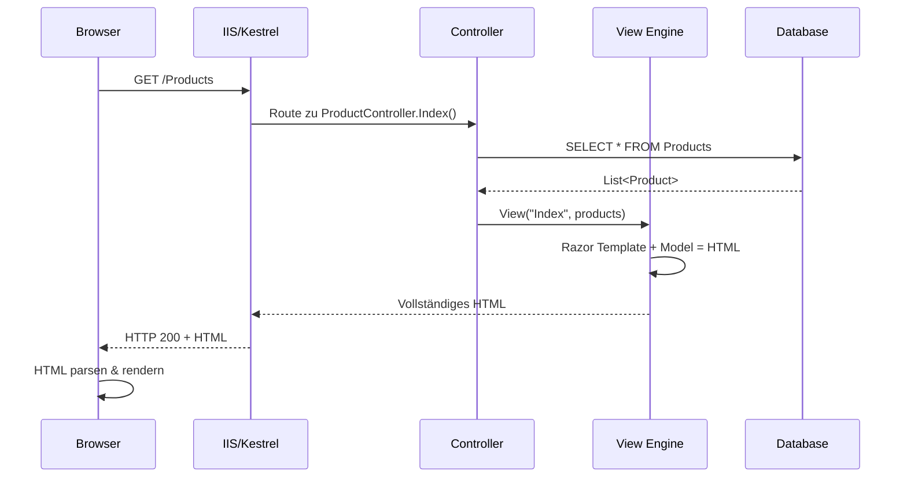

Der Code dafür sieht so aus:

**Controller (C#):**
```csharp
public class ProductController : Controller
{
    private readonly IProductRepository _repository;

    public ProductController(IProductRepository repository)
    {
        _repository = repository;
    }

    public async Task<IActionResult> Index()
    {
        var products = await _repository.GetAllAsync();
        return View(products);
    }

    public async Task<IActionResult> Details(int id)
    {
        var product = await _repository.GetByIdAsync(id);
        if (product == null)
            return NotFound();

        return View(product);
    }

    [HttpPost]
    [ValidateAntiForgeryToken]
    public async Task<IActionResult> Create(ProductViewModel model)
    {
        if (!ModelState.IsValid)
            return View(model);

        await _repository.CreateAsync(model.ToEntity());
        return RedirectToAction(nameof(Index));
    }
}
```

**Razor View (Index.cshtml):**
```html
@model IEnumerable<Product>

@{
    ViewData["Title"] = "Produkte";
}

<h1>Produktliste</h1>

<p>
    <a asp-action="Create" class="btn btn-primary">Neues Produkt</a>
</p>

<table class="table">
    <thead>
        <tr>
            <th>@Html.DisplayNameFor(model => model.Name)</th>
            <th>@Html.DisplayNameFor(model => model.Price)</th>
            <th>@Html.DisplayNameFor(model => model.Category)</th>
            <th>Aktionen</th>
        </tr>
    </thead>
    <tbody>
        @foreach (var item in Model)
        {
            <tr>
                <td>@Html.DisplayFor(modelItem => item.Name)</td>
                <td>@Html.DisplayFor(modelItem => item.Price) €</td>
                <td>@Html.DisplayFor(modelItem => item.Category)</td>
                <td>
                    <a asp-action="Edit" asp-route-id="@item.Id">Bearbeiten</a> |
                    <a asp-action="Details" asp-route-id="@item.Id">Details</a> |
                    <a asp-action="Delete" asp-route-id="@item.Id">Löschen</a>
                </td>
            </tr>
        }
    </tbody>
</table>

@section Scripts {
    @{await Html.RenderPartialAsync("_ValidationScriptsPartial");}
}
```

**Vorteile dieses Ansatzes:**
- SEO-freundlich (Suchmaschinen sehen fertiges HTML)
- Schnelle initiale Ladezeit (Time to First Contentful Paint)
- Einfaches mentales Modell
- Funktioniert ohne JavaScript

**Nachteile:**
- Jede Interaktion = kompletter Page Reload
- Server muss bei jeder Anfrage rendern
- Zustand geht bei Navigation verloren
- Schwer, flüssige UX zu erreichen

### Das SPA/React-Modell: Browser rendert

Im modernen Ansatz verschiebt sich die Rendering-Logik in den Browser:

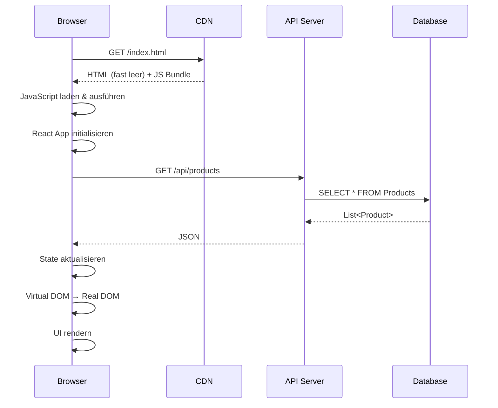

**React-Komponente (ProductList.tsx):**
```tsx
import { useState, useEffect } from 'react';
import { Link } from 'react-router-dom';

interface Product {
    id: number;
    name: string;
    price: number;
    category: string;
}

export function ProductList() {
    const [products, setProducts] = useState<Product[]>([]);
    const [loading, setLoading] = useState(true);
    const [error, setError] = useState<string | null>(null);

    useEffect(() => {
        async function fetchProducts() {
            try {
                const response = await fetch('/api/products');
                if (!response.ok) {
                    throw new Error('Fehler beim Laden der Produkte');
                }
                const data = await response.json();
                setProducts(data);
            } catch (err) {
                setError(err instanceof Error ? err.message : 'Unbekannter Fehler');
            } finally {
                setLoading(false);
            }
        }

        fetchProducts();
    }, []);

    if (loading) {
        return <div className="spinner">Laden...</div>;
    }

    if (error) {
        return <div className="alert alert-danger">{error}</div>;
    }

    return (
        <div>
            <h1>Produktliste</h1>

            <p>
                <Link to="/products/create" className="btn btn-primary">
                    Neues Produkt
                </Link>
            </p>

            <table className="table">
                <thead>
                    <tr>
                        <th>Name</th>
                        <th>Preis</th>
                        <th>Kategorie</th>
                        <th>Aktionen</th>
                    </tr>
                </thead>
                <tbody>
                    {products.map(product => (
                        <tr key={product.id}>
                            <td>{product.name}</td>
                            <td>{product.price.toFixed(2)} €</td>
                            <td>{product.category}</td>
                            <td>
                                <Link to={`/products/edit/${product.id}`}>
                                    Bearbeiten
                                </Link>
                                {' | '}
                                <Link to={`/products/${product.id}`}>
                                    Details
                                </Link>
                                {' | '}
                                <Link to={`/products/delete/${product.id}`}>
                                    Löschen
                                </Link>
                            </td>
                        </tr>
                    ))}
                </tbody>
            </table>
        </div>
    );
}
```

**Express.js API Route (Node.js):**
```javascript
import express from 'express';
import { ProductRepository } from '../repositories/productRepository.js';

const router = express.Router();
const productRepository = new ProductRepository();

// GET /api/products
router.get('/', async (req, res) => {
    try {
        const products = await productRepository.getAll();
        res.json(products);
    } catch (error) {
        console.error('Fehler beim Laden der Produkte:', error);
        res.status(500).json({ error: 'Interner Serverfehler' });
    }
});

// GET /api/products/:id
router.get('/:id', async (req, res) => {
    try {
        const product = await productRepository.getById(req.params.id);
        if (!product) {
            return res.status(404).json({ error: 'Produkt nicht gefunden' });
        }
        res.json(product);
    } catch (error) {
        console.error('Fehler beim Laden des Produkts:', error);
        res.status(500).json({ error: 'Interner Serverfehler' });
    }
});

// POST /api/products
router.post('/', async (req, res) => {
    try {
        const { name, price, category } = req.body;

        // Validierung
        if (!name || !price || !category) {
            return res.status(400).json({
                error: 'Name, Preis und Kategorie sind erforderlich'
            });
        }

        const newProduct = await productRepository.create({
            name,
            price,
            category
        });

        res.status(201).json(newProduct);
    } catch (error) {
        console.error('Fehler beim Erstellen des Produkts:', error);
        res.status(500).json({ error: 'Interner Serverfehler' });
    }
});

export default router;
```

**Vorteile des SPA-Ansatzes:**
- Flüssige, App-ähnliche UX
- Nur Daten werden übertragen (JSON statt HTML)
- Zustand bleibt bei Navigation erhalten
- Offline-Fähigkeit möglich (Service Workers)

**Nachteile:**
- SEO erfordert zusätzliche Maßnahmen (SSR, Pre-rendering)
- Größeres initiales Bundle
- JavaScript zwingend erforderlich
- Komplexeres Setup

### Der hybride Ansatz: Das Beste aus beiden Welten

Moderne Frameworks wie Next.js (React) oder Nuxt (Vue) bieten Server-Side Rendering für SPAs:

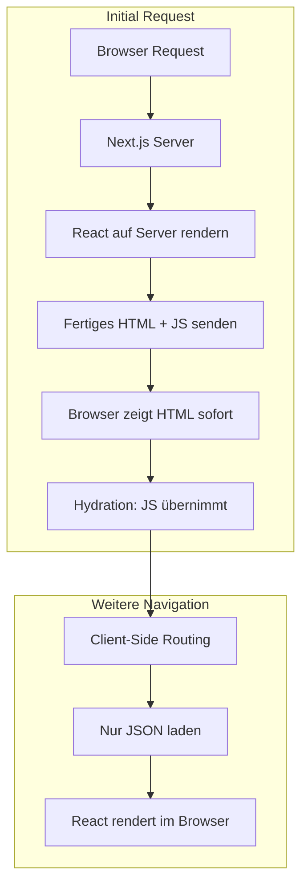

**Next.js Server Component Beispiel:**
```tsx
// app/products/page.tsx (Next.js 13+ App Router)

import { ProductRepository } from '@/lib/repositories/productRepository';
import { ProductTable } from '@/components/ProductTable';
import Link from 'next/link';

// Diese Komponente wird auf dem Server gerendert!
export default async function ProductsPage() {
    const productRepository = new ProductRepository();
    const products = await productRepository.getAll();

    return (
        <div>
            <h1>Produktliste</h1>

            <p>
                <Link href="/products/create" className="btn btn-primary">
                    Neues Produkt
                </Link>
            </p>

            {/* ProductTable ist eine Client-Komponente für Interaktivität */}
            <ProductTable initialProducts={products} />
        </div>
    );
}

// Metadata für SEO
export const metadata = {
    title: 'Produkte',
    description: 'Alle verfügbaren Produkte'
};
```

---

## Request/Response vs. Reaktive UIs

### Das MVC-Modell: Aktionen und Seitenladevorgänge

Im klassischen MVC-Modell folgt jede Benutzerinteraktion dem gleichen Muster:

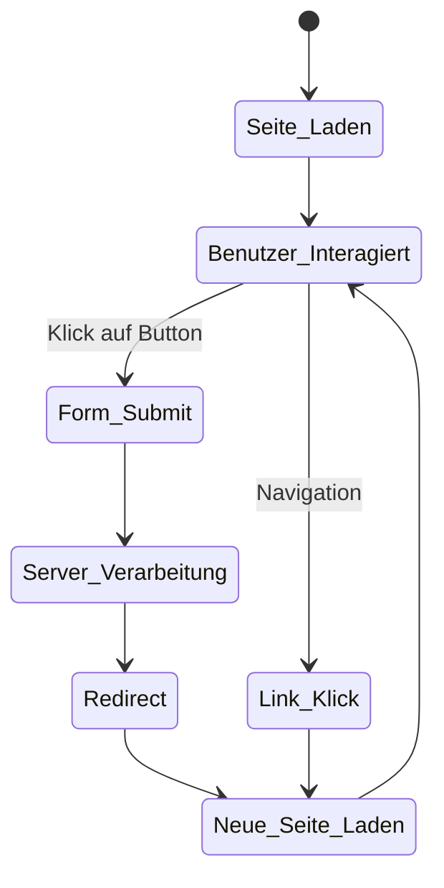

**Typischer MVC Edit-Flow:**

```csharp
// Controller
public async Task<IActionResult> Edit(int id)
{
    var product = await _repository.GetByIdAsync(id);
    if (product == null)
        return NotFound();

    var viewModel = new ProductEditViewModel
    {
        Id = product.Id,
        Name = product.Name,
        Price = product.Price,
        CategoryId = product.CategoryId,
        Categories = await _categoryRepository.GetAllAsync()
    };

    return View(viewModel);
}

[HttpPost]
[ValidateAntiForgeryToken]
public async Task<IActionResult> Edit(int id, ProductEditViewModel model)
{
    if (id != model.Id)
        return BadRequest();

    if (!ModelState.IsValid)
    {
        model.Categories = await _categoryRepository.GetAllAsync();
        return View(model);
    }

    try
    {
        await _repository.UpdateAsync(model.ToEntity());
        TempData["Success"] = "Produkt erfolgreich aktualisiert!";
        return RedirectToAction(nameof(Index));
    }
    catch (DbUpdateConcurrencyException)
    {
        if (!await _repository.ExistsAsync(id))
            return NotFound();
        throw;
    }
}
```

```html
<!-- Edit.cshtml -->
@model ProductEditViewModel

<h1>Produkt bearbeiten</h1>

<form asp-action="Edit">
    <input type="hidden" asp-for="Id" />

    <div class="form-group">
        <label asp-for="Name"></label>
        <input asp-for="Name" class="form-control" />
        <span asp-validation-for="Name" class="text-danger"></span>
    </div>

    <div class="form-group">
        <label asp-for="Price"></label>
        <input asp-for="Price" class="form-control" />
        <span asp-validation-for="Price" class="text-danger"></span>
    </div>

    <div class="form-group">
        <label asp-for="CategoryId"></label>
        <select asp-for="CategoryId" asp-items="Model.Categories" class="form-control">
            <option value="">-- Bitte wählen --</option>
        </select>
        <span asp-validation-for="CategoryId" class="text-danger"></span>
    </div>

    <button type="submit" class="btn btn-primary">Speichern</button>
    <a asp-action="Index" class="btn btn-secondary">Abbrechen</a>
</form>

@section Scripts {
    @{await Html.RenderPartialAsync("_ValidationScriptsPartial");}
}
```

**Das Problem:** Bei jedem Speichern wird die gesamte Seite neu geladen. Der Benutzer sieht einen kurzen weißen Bildschirm. Scroll-Position geht verloren. Es fühlt sich "langsam" an.

### Das React-Modell: State und Reaktivität

In React basiert alles auf dem Konzept von **State** (Zustand). Wenn sich der State ändert, rendert React automatisch die betroffenen Komponenten neu - ohne Seitenladen:

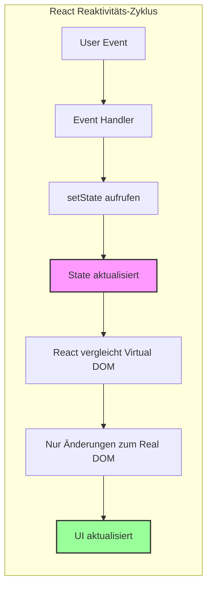

**React Edit-Komponente:**

```tsx
import { useState, useEffect, FormEvent, ChangeEvent } from 'react';
import { useParams, useNavigate } from 'react-router-dom';

interface Product {
    id: number;
    name: string;
    price: number;
    categoryId: number;
}

interface Category {
    id: number;
    name: string;
}

interface FormErrors {
    name?: string;
    price?: string;
    categoryId?: string;
}

export function ProductEdit() {
    const { id } = useParams<{ id: string }>();
    const navigate = useNavigate();

    // State für die Formulardaten
    const [product, setProduct] = useState<Product>({
        id: 0,
        name: '',
        price: 0,
        categoryId: 0
    });

    // State für Kategorien (Dropdown-Optionen)
    const [categories, setCategories] = useState<Category[]>([]);

    // State für UI-Feedback
    const [loading, setLoading] = useState(true);
    const [saving, setSaving] = useState(false);
    const [errors, setErrors] = useState<FormErrors>({});
    const [successMessage, setSuccessMessage] = useState<string | null>(null);

    // Daten laden beim Component Mount
    useEffect(() => {
        async function loadData() {
            try {
                const [productRes, categoriesRes] = await Promise.all([
                    fetch(`/api/products/${id}`),
                    fetch('/api/categories')
                ]);

                if (!productRes.ok) {
                    throw new Error('Produkt nicht gefunden');
                }

                const productData = await productRes.json();
                const categoriesData = await categoriesRes.json();

                setProduct(productData);
                setCategories(categoriesData);
            } catch (error) {
                console.error(error);
                navigate('/products');
            } finally {
                setLoading(false);
            }
        }

        loadData();
    }, [id, navigate]);

    // Validierung
    function validate(): boolean {
        const newErrors: FormErrors = {};

        if (!product.name.trim()) {
            newErrors.name = 'Name ist erforderlich';
        }

        if (product.price <= 0) {
            newErrors.price = 'Preis muss größer als 0 sein';
        }

        if (!product.categoryId) {
            newErrors.categoryId = 'Bitte wählen Sie eine Kategorie';
        }

        setErrors(newErrors);
        return Object.keys(newErrors).length === 0;
    }

    // Input-Handler - aktualisiert State bei jeder Eingabe
    function handleChange(
        e: ChangeEvent<HTMLInputElement | HTMLSelectElement>
    ) {
        const { name, value } = e.target;

        setProduct(prev => ({
            ...prev,
            [name]: name === 'price' || name === 'categoryId'
                ? Number(value)
                : value
        }));

        // Fehler für dieses Feld löschen bei Eingabe
        if (errors[name as keyof FormErrors]) {
            setErrors(prev => ({ ...prev, [name]: undefined }));
        }
    }

    // Form Submit Handler
    async function handleSubmit(e: FormEvent) {
        e.preventDefault();

        if (!validate()) {
            return;
        }

        setSaving(true);
        setSuccessMessage(null);

        try {
            const response = await fetch(`/api/products/${id}`, {
                method: 'PUT',
                headers: {
                    'Content-Type': 'application/json',
                },
                body: JSON.stringify(product),
            });

            if (!response.ok) {
                const error = await response.json();
                throw new Error(error.message || 'Fehler beim Speichern');
            }

            setSuccessMessage('Produkt erfolgreich aktualisiert!');

            // Optional: Nach kurzer Zeit zur Liste navigieren
            setTimeout(() => {
                navigate('/products');
            }, 1500);

        } catch (error) {
            setErrors({
                name: error instanceof Error ? error.message : 'Unbekannter Fehler'
            });
        } finally {
            setSaving(false);
        }
    }

    if (loading) {
        return <div className="spinner">Laden...</div>;
    }

    return (
        <div>
            <h1>Produkt bearbeiten</h1>

            {successMessage && (
                <div className="alert alert-success">{successMessage}</div>
            )}

            <form onSubmit={handleSubmit}>
                <div className="form-group">
                    <label htmlFor="name">Name</label>
                    <input
                        type="text"
                        id="name"
                        name="name"
                        className={`form-control ${errors.name ? 'is-invalid' : ''}`}
                        value={product.name}
                        onChange={handleChange}
                    />
                    {errors.name && (
                        <div className="invalid-feedback">{errors.name}</div>
                    )}
                </div>

                <div className="form-group">
                    <label htmlFor="price">Preis</label>
                    <input
                        type="number"
                        id="price"
                        name="price"
                        step="0.01"
                        className={`form-control ${errors.price ? 'is-invalid' : ''}`}
                        value={product.price}
                        onChange={handleChange}
                    />
                    {errors.price && (
                        <div className="invalid-feedback">{errors.price}</div>
                    )}
                </div>

                <div className="form-group">
                    <label htmlFor="categoryId">Kategorie</label>
                    <select
                        id="categoryId"
                        name="categoryId"
                        className={`form-control ${errors.categoryId ? 'is-invalid' : ''}`}
                        value={product.categoryId}
                        onChange={handleChange}
                    >
                        <option value="">-- Bitte wählen --</option>
                        {categories.map(cat => (
                            <option key={cat.id} value={cat.id}>
                                {cat.name}
                            </option>
                        ))}
                    </select>
                    {errors.categoryId && (
                        <div className="invalid-feedback">{errors.categoryId}</div>
                    )}
                </div>

                <button
                    type="submit"
                    className="btn btn-primary"
                    disabled={saving}
                >
                    {saving ? 'Speichern...' : 'Speichern'}
                </button>

                <button
                    type="button"
                    className="btn btn-secondary ml-2"
                    onClick={() => navigate('/products')}
                >
                    Abbrechen
                </button>
            </form>
        </div>
    );
}
```

### Der entscheidende Unterschied: Sofortiges Feedback

Betrachte diese Szenarien:

**Szenario 1: Formular mit Validierungsfehler**

| MVC/Razor | React |
|-----------|-------|
| User klickt "Speichern" | User klickt "Speichern" |
| HTTP POST zum Server | JavaScript validiert sofort |
| Server validiert | Fehler wird angezeigt |
| Server rendert View mit Fehlern | Kein Server-Kontakt nötig |
| Browser lädt neue Seite | UI aktualisiert sich instant |
| ~500ms - 2000ms | ~10ms |

**Szenario 2: Live-Suche**

In MVC brauchst du AJAX:
```html
<!-- MVC/Razor -->
<input type="text" id="searchBox" />
<div id="searchResults"></div>

<script>
    $('#searchBox').on('input', function() {
        var query = $(this).val();
        $.ajax({
            url: '@Url.Action("Search", "Products")',
            data: { query: query },
            success: function(html) {
                $('#searchResults').html(html);
            }
        });
    });
</script>
```

In React ist es natürlicher:
```tsx
function ProductSearch() {
    const [query, setQuery] = useState('');
    const [results, setResults] = useState<Product[]>([]);

    // Debounced Search
    useEffect(() => {
        if (!query.trim()) {
            setResults([]);
            return;
        }

        const timeoutId = setTimeout(async () => {
            const response = await fetch(
                `/api/products/search?q=${encodeURIComponent(query)}`
            );
            const data = await response.json();
            setResults(data);
        }, 300);

        return () => clearTimeout(timeoutId);
    }, [query]);

    return (
        <div>
            <input
                type="text"
                value={query}
                onChange={e => setQuery(e.target.value)}
                placeholder="Produkt suchen..."
            />

            <ul>
                {results.map(product => (
                    <li key={product.id}>{product.name}</li>
                ))}
            </ul>
        </div>
    );
}
```

### State Management verstehen

Als MVC-Entwickler bist du es gewohnt, dass der Server die "Wahrheit" hält. In React ist der Client-State die lokale Wahrheit:

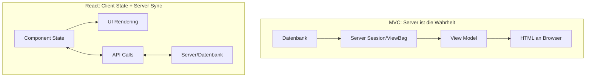

**State-Ebenen in React:**

```tsx
// 1. Lokaler Component State - für UI-Zustand
const [isOpen, setIsOpen] = useState(false);
const [inputValue, setInputValue] = useState('');

// 2. Gehobener State - wenn mehrere Komponenten Zugriff brauchen
function Parent() {
    const [sharedData, setSharedData] = useState(null);

    return (
        <>
            <ChildA data={sharedData} />
            <ChildB onUpdate={setSharedData} />
        </>
    );
}

// 3. Context - für App-weite Daten
const UserContext = createContext<User | null>(null);

function App() {
    const [user, setUser] = useState<User | null>(null);

    return (
        <UserContext.Provider value={user}>
            <Header />
            <Main />
            <Footer />
        </UserContext.Provider>
    );
}

// 4. Externe State-Libraries (Redux, Zustand, Jotai)
// Für komplexe Anwendungen mit viel geteiltem State
```

---

## Die Trennung von Frontend und Backend

### Der Monolith: ASP.NET MVC

In einer klassischen MVC-Anwendung ist alles eng verzahnt:

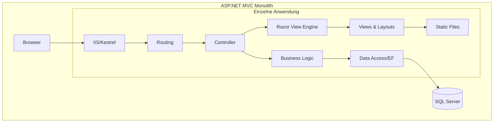

**Projektstruktur eines MVC-Monolithen:**
```
MyWebApp/
├── Controllers/
│   ├── HomeController.cs
│   ├── ProductController.cs
│   └── AccountController.cs
├── Models/
│   ├── Product.cs
│   ├── Category.cs
│   └── ViewModels/
│       ├── ProductViewModel.cs
│       └── ProductEditViewModel.cs
├── Views/
│   ├── Home/
│   │   └── Index.cshtml
│   ├── Product/
│   │   ├── Index.cshtml
│   │   ├── Edit.cshtml
│   │   └── _ProductCard.cshtml
│   └── Shared/
│       ├── _Layout.cshtml
│       └── _ValidationScriptsPartial.cshtml
├── wwwroot/
│   ├── css/
│   ├── js/
│   └── lib/
├── Data/
│   └── ApplicationDbContext.cs
├── Services/
│   └── ProductService.cs
├── appsettings.json
├── Program.cs
└── MyWebApp.csproj
```

**Deployment:** Ein einziges Paket, ein Server, eine Anwendung.

### Die moderne Architektur: API + SPA

Heute werden Frontend und Backend oft komplett getrennt:

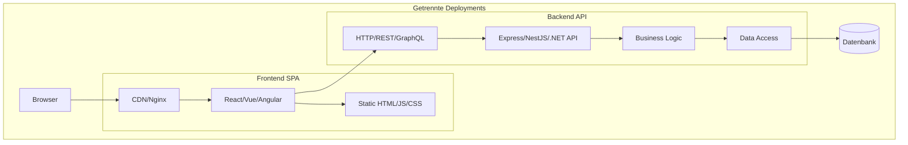

**Frontend-Projektstruktur (React + Vite):**
```
frontend/
├── src/
│   ├── components/
│   │   ├── common/
│   │   │   ├── Button.tsx
│   │   │   ├── Input.tsx
│   │   │   └── Modal.tsx
│   │   ├── products/
│   │   │   ├── ProductList.tsx
│   │   │   ├── ProductCard.tsx
│   │   │   └── ProductForm.tsx
│   │   └── layout/
│   │       ├── Header.tsx
│   │       ├── Footer.tsx
│   │       └── Sidebar.tsx
│   ├── pages/
│   │   ├── HomePage.tsx
│   │   ├── ProductsPage.tsx
│   │   └── ProductDetailPage.tsx
│   ├── hooks/
│   │   ├── useProducts.ts
│   │   └── useAuth.ts
│   ├── services/
│   │   ├── api.ts
│   │   └── productService.ts
│   ├── types/
│   │   └── index.ts
│   ├── App.tsx
│   └── main.tsx
├── public/
│   └── favicon.ico
├── index.html
├── package.json
├── tsconfig.json
└── vite.config.ts
```

**Backend-Projektstruktur (Node.js + Express):**
```
backend/
├── src/
│   ├── routes/
│   │   ├── index.ts
│   │   ├── products.ts
│   │   ├── categories.ts
│   │   └── auth.ts
│   ├── controllers/
│   │   ├── productController.ts
│   │   └── authController.ts
│   ├── services/
│   │   ├── productService.ts
│   │   └── authService.ts
│   ├── repositories/
│   │   └── productRepository.ts
│   ├── models/
│   │   ├── Product.ts
│   │   └── Category.ts
│   ├── middleware/
│   │   ├── auth.ts
│   │   ├── errorHandler.ts
│   │   └── validation.ts
│   ├── utils/
│   │   └── helpers.ts
│   ├── config/
│   │   └── database.ts
│   └── app.ts
├── prisma/
│   └── schema.prisma
├── package.json
├── tsconfig.json
└── .env
```

### Der API-Contract: Die neue Schnittstelle

Anstatt dass Controller Views rendern, liefern sie jetzt JSON:

**ASP.NET Core Web API (falls du beim Backend bei .NET bleiben willst):**
```csharp
[ApiController]
[Route("api/[controller]")]
public class ProductsController : ControllerBase
{
    private readonly IProductService _productService;

    public ProductsController(IProductService productService)
    {
        _productService = productService;
    }

    [HttpGet]
    public async Task<ActionResult<IEnumerable<ProductDto>>> GetAll()
    {
        var products = await _productService.GetAllAsync();
        return Ok(products);
    }

    [HttpGet("{id}")]
    public async Task<ActionResult<ProductDto>> GetById(int id)
    {
        var product = await _productService.GetByIdAsync(id);
        if (product == null)
            return NotFound();

        return Ok(product);
    }

    [HttpPost]
    public async Task<ActionResult<ProductDto>> Create(CreateProductDto dto)
    {
        var product = await _productService.CreateAsync(dto);
        return CreatedAtAction(
            nameof(GetById),
            new { id = product.Id },
            product
        );
    }

    [HttpPut("{id}")]
    public async Task<IActionResult> Update(int id, UpdateProductDto dto)
    {
        if (id != dto.Id)
            return BadRequest();

        await _productService.UpdateAsync(dto);
        return NoContent();
    }

    [HttpDelete("{id}")]
    public async Task<IActionResult> Delete(int id)
    {
        await _productService.DeleteAsync(id);
        return NoContent();
    }
}
```

**Äquivalent in Express.js (Node.js):**
```typescript
import { Router, Request, Response } from 'express';
import { ProductService } from '../services/productService';
import { validateProduct } from '../middleware/validation';

const router = Router();
const productService = new ProductService();

// GET /api/products
router.get('/', async (req: Request, res: Response) => {
    const products = await productService.getAll();
    res.json(products);
});

// GET /api/products/:id
router.get('/:id', async (req: Request, res: Response) => {
    const product = await productService.getById(Number(req.params.id));
    if (!product) {
        return res.status(404).json({ error: 'Not found' });
    }
    res.json(product);
});

// POST /api/products
router.post('/', validateProduct, async (req: Request, res: Response) => {
    const product = await productService.create(req.body);
    res.status(201).json(product);
});

// PUT /api/products/:id
router.put('/:id', validateProduct, async (req: Request, res: Response) => {
    const id = Number(req.params.id);
    if (id !== req.body.id) {
        return res.status(400).json({ error: 'ID mismatch' });
    }
    await productService.update(req.body);
    res.status(204).send();
});

// DELETE /api/products/:id
router.delete('/:id', async (req: Request, res: Response) => {
    await productService.delete(Number(req.params.id));
    res.status(204).send();
});

export default router;
```

### Vorteile der Trennung

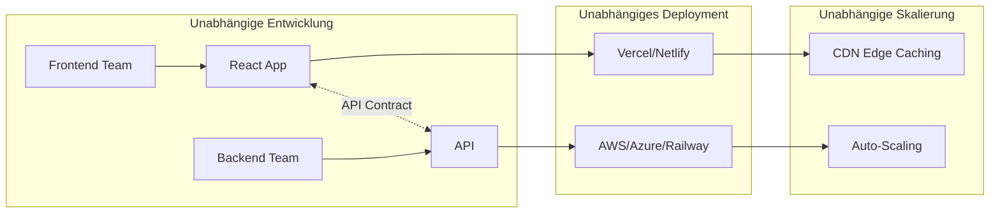

| Aspekt | Monolith | Getrennt |
|--------|----------|----------|
| Deployment | Alles oder nichts | Unabhängig |
| Skalierung | Vertikal (größerer Server) | Horizontal (mehr Instanzen) |
| Team-Arbeit | Merge-Konflikte | Parallele Entwicklung |
| Technologie | Eine Sprache/Framework | Best Tool for the Job |
| Testing | Integration schwierig | Klare Grenzen |
| Ausfallsicherheit | Single Point of Failure | Graceful Degradation |

---

## Was ist "besser" und warum?

### User Experience (UX)

**Szenario: E-Commerce Warenkorb**

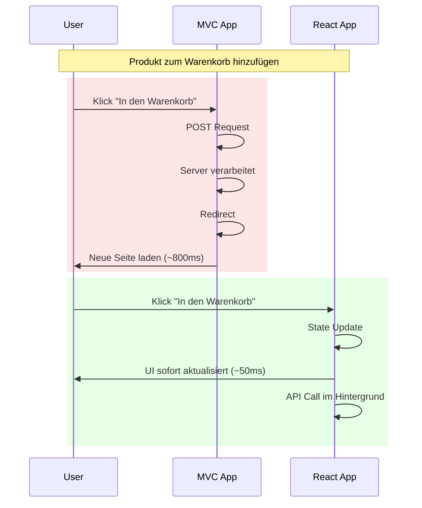

**Wahrgenommene Performance ist entscheidend:**

Der User sieht sofort eine Reaktion. Der tatsächliche API-Call kann im Hintergrund passieren. Das nennt sich "Optimistic UI":

```tsx
function AddToCartButton({ product }: { product: Product }) {
    const [isAdding, setIsAdding] = useState(false);
    const [isAdded, setIsAdded] = useState(false);
    const { addToCart } = useCart();

    async function handleClick() {
        // Sofortiges UI-Feedback (optimistisch)
        setIsAdding(true);
        setIsAdded(true);

        // Lokalen State aktualisieren
        addToCart(product);

        try {
            // API-Call im Hintergrund
            await fetch('/api/cart/items', {
                method: 'POST',
                headers: { 'Content-Type': 'application/json' },
                body: JSON.stringify({ productId: product.id }),
            });
        } catch (error) {
            // Bei Fehler: Rollback
            setIsAdded(false);
            removeFromCart(product.id);
            alert('Fehler beim Hinzufügen zum Warenkorb');
        } finally {
            setIsAdding(false);
        }
    }

    return (
        <button
            onClick={handleClick}
            disabled={isAdding}
            className={isAdded ? 'btn-success' : 'btn-primary'}
        >
            {isAdded ? '✓ Im Warenkorb' : 'In den Warenkorb'}
        </button>
    );
}
```

### Developer Experience (DX)

**Hot Module Replacement (HMR) - Der Game Changer:**

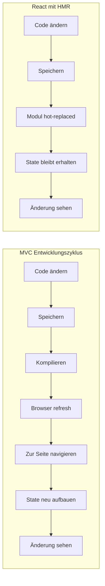

| Aspekt | MVC | React + Vite |
|--------|-----|--------------|
| Code-Änderung → sichtbar | 3-10 Sekunden | <1 Sekunde |
| State bei Änderung | Verloren | Erhalten |
| Compile-Fehler | Runtime Exception | Sofort im Editor |
| CSS-Änderungen | Page Reload | Instant Update |

**Beispiel: Component-basierte Entwicklung**

In MVC sind Views oft lang und unübersichtlich. In React zerlegst du alles in kleine, wiederverwendbare Komponenten:

```tsx
// Kleine, fokussierte Komponenten
function PriceDisplay({ price, currency = '€' }: PriceProps) {
    return (
        <span className="price">
            {price.toFixed(2)} {currency}
        </span>
    );
}

function StockBadge({ inStock }: { inStock: boolean }) {
    return (
        <span className={`badge ${inStock ? 'badge-success' : 'badge-danger'}`}>
            {inStock ? 'Auf Lager' : 'Ausverkauft'}
        </span>
    );
}

function ProductRating({ rating, reviewCount }: RatingProps) {
    return (
        <div className="rating">
            {'★'.repeat(Math.round(rating))}
            {'☆'.repeat(5 - Math.round(rating))}
            <span className="review-count">({reviewCount} Bewertungen)</span>
        </div>
    );
}

// Zusammengesetzt zu einer größeren Komponente
function ProductCard({ product }: { product: Product }) {
    return (
        <div className="product-card">
            
            <h3>{product.name}</h3>
            <PriceDisplay price={product.price} />
            <StockBadge inStock={product.inStock} />
            <ProductRating
                rating={product.rating}
                reviewCount={product.reviewCount}
            />
            <AddToCartButton product={product} />
        </div>
    );
}
```

### Skalierbarkeit

**Horizontale Skalierung:**

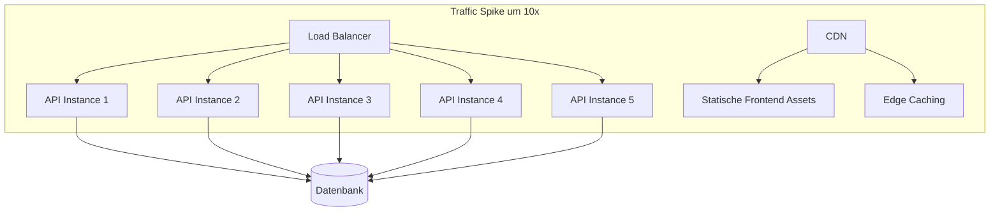

**Frontend:**
- Statische Dateien → CDN → Unendlich skalierbar
- Keine Server-Kosten pro Request für UI

**Backend:**
- Nur JSON verarbeiten (kein HTML rendern)
- Leichtere Instanzen möglich
- Einfacher horizontal skalierbar

---

## Die Lernkurve - Eine ehrliche Einschätzung

### Was einfacher wird

| Aspekt | Warum es einfacher ist |
|--------|----------------------|
| UI-Interaktivität | Keine AJAX-Boilerplate, State-basiert |
| Komponenten-Wiederverwendung | Props rein, UI raus |
| Styling | CSS-in-JS, Tailwind, CSS Modules |
| Testing | Komponenten isoliert testbar |
| Type Safety | TypeScript von Anfang an |
| Tooling | npm-Ökosystem ist riesig |

### Was schwieriger wird

| Aspekt | Warum es schwieriger ist |
|--------|-------------------------|
| Initiales Setup | Viele Tools, viele Konfigurationen |
| State Management | Neue Denkweise erforderlich |
| SEO | Zusätzliche Maßnahmen nötig |
| Bundle Size | Muss aktiv optimiert werden |
| Security | CORS, Token-Handling, XSS |
| Debugging | Browser DevTools anders als VS Debugger |

### Realistische Zeitschätzungen

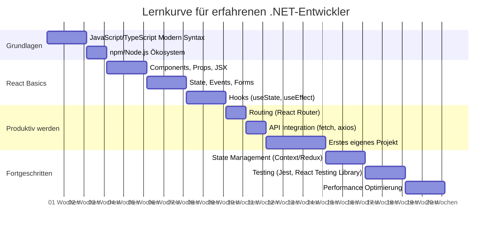

**Zusammenfassung:**
- **4-6 Wochen**: Grundlagen verstanden, erste einfache Apps
- **3-4 Monate**: Produktiv einsetzbar für normale Projekte
- **6-12 Monate**: Fortgeschrittene Patterns, Performance, Best Practices

### Tipps für den Umstieg

1. **Vergiss nicht, was du weißt**: Patterns wie Repository, Service Layer, Dependency Injection gelten auch in Node.js

2. **TypeScript sofort nutzen**: Als C#-Entwickler wirst du dich ohne Types unwohl fühlen - zurecht!

3. **Kleine Schritte**: Erst React lernen, dann Routing, dann State Management, dann Testing

4. **Nicht alles auf einmal**: Du brauchst nicht Redux, GraphQL, und Next.js am ersten Tag

5. **Praktisch üben**: Die gleiche App in MVC und React bauen hilft enorm

---

## Vergleichstabelle: .NET MVC → React/Node Äquivalente

### Architektur-Konzepte

| .NET MVC | React/Node.js | Anmerkungen |
|----------|---------------|-------------|
| Controller | Express Router + React Components | Controller-Logik wird aufgeteilt |
| Action Method | Route Handler / Event Handler | `router.get()` bzw. `onClick` |
| View | React Component | JSX statt Razor |
| Partial View | React Component | Wiederverwendbare UI-Teile |
| Layout | Layout Component | `<Layout><Children /></Layout>` |
| ViewBag/ViewData | Props/Context | Daten an Komponenten übergeben |
| TempData | URL State / Toast Notifications | Temporäre Nachrichten |
| Session | JWT / localStorage | Client-seitige Authentifizierung |

### Code-Beispiele im direkten Vergleich

**Routing:**

```csharp
// ASP.NET MVC - Startup.cs
app.MapControllerRoute(
    name: "default",
    pattern: "{controller=Home}/{action=Index}/{id?}");

// Attribut-basiert
[Route("products")]
public class ProductController : Controller
{
    [HttpGet]
    public IActionResult Index() { }

    [HttpGet("{id}")]
    public IActionResult Details(int id) { }
}
```

```typescript
// Express.js
import express from 'express';
import productRoutes from './routes/products';

const app = express();
app.use('/api/products', productRoutes);

// routes/products.ts
const router = Router();
router.get('/', getAllProducts);
router.get('/:id', getProductById);
export default router;
```

```tsx
// React Router
import { BrowserRouter, Routes, Route } from 'react-router-dom';

function App() {
    return (
        <BrowserRouter>
            <Routes>
                <Route path="/" element={<HomePage />} />
                <Route path="/products" element={<ProductList />} />
                <Route path="/products/:id" element={<ProductDetail />} />
            </Routes>
        </BrowserRouter>
    );
}
```

**Dependency Injection:**

```csharp
// ASP.NET Core DI
public class Startup
{
    public void ConfigureServices(IServiceCollection services)
    {
        services.AddScoped<IProductRepository, ProductRepository>();
        services.AddScoped<IProductService, ProductService>();
    }
}

public class ProductController : Controller
{
    private readonly IProductService _service;

    public ProductController(IProductService service)
    {
        _service = service;
    }
}
```

```typescript
// Node.js mit tsyringe (oder ähnlich)
import { container, injectable, inject } from 'tsyringe';

@injectable()
class ProductService {
    constructor(
        @inject('ProductRepository') private repository: IProductRepository
    ) {}
}

// Oder einfacher: Factory Functions
function createProductService(repository: IProductRepository): ProductService {
    return {
        getAll: () => repository.findAll(),
        getById: (id) => repository.findById(id),
    };
}
```

```tsx
// React mit Context für DI
const ServiceContext = createContext<Services | null>(null);

function App() {
    const services = useMemo(() => ({
        productService: new ProductService(),
        authService: new AuthService(),
    }), []);

    return (
        <ServiceContext.Provider value={services}>
            <Router />
        </ServiceContext.Provider>
    );
}

// Nutzung in Komponenten
function ProductList() {
    const { productService } = useContext(ServiceContext)!;
    // ...
}
```

**Model Validation:**

```csharp
// ASP.NET Data Annotations
public class ProductViewModel
{
    [Required(ErrorMessage = "Name ist erforderlich")]
    [StringLength(100, MinimumLength = 3)]
    public string Name { get; set; }

    [Required]
    [Range(0.01, 10000)]
    public decimal Price { get; set; }

    [Required]
    public int CategoryId { get; set; }
}

// Controller
[HttpPost]
public IActionResult Create(ProductViewModel model)
{
    if (!ModelState.IsValid)
        return View(model);
    // ...
}
```

```typescript
// Node.js mit Zod
import { z } from 'zod';

const ProductSchema = z.object({
    name: z.string()
        .min(3, 'Name muss mindestens 3 Zeichen haben')
        .max(100, 'Name darf maximal 100 Zeichen haben'),
    price: z.number()
        .min(0.01, 'Preis muss positiv sein')
        .max(10000, 'Preis zu hoch'),
    categoryId: z.number().int().positive(),
});

type Product = z.infer<typeof ProductSchema>;

// Express Middleware
function validateProduct(req: Request, res: Response, next: NextFunction) {
    const result = ProductSchema.safeParse(req.body);
    if (!result.success) {
        return res.status(400).json({
            errors: result.error.flatten().fieldErrors
        });
    }
    req.body = result.data;
    next();
}
```

```tsx
// React mit React Hook Form + Zod
import { useForm } from 'react-hook-form';
import { zodResolver } from '@hookform/resolvers/zod';

function ProductForm() {
    const {
        register,
        handleSubmit,
        formState: { errors }
    } = useForm<Product>({
        resolver: zodResolver(ProductSchema)
    });

    return (
        <form onSubmit={handleSubmit(onSubmit)}>
            <input {...register('name')} />
            {errors.name && <span>{errors.name.message}</span>}

            <input type="number" {...register('price', { valueAsNumber: true })} />
            {errors.price && <span>{errors.price.message}</span>}

            <button type="submit">Speichern</button>
        </form>
    );
}
```

**Authentication/Authorization:**

```csharp
// ASP.NET Core Identity
[Authorize]
public class ProductController : Controller
{
    [AllowAnonymous]
    public IActionResult Index() { }

    [Authorize(Roles = "Admin")]
    public IActionResult Create() { }
}

// In Razor Views
@if (User.Identity.IsAuthenticated)
{
    <span>Willkommen, @User.Identity.Name!</span>
}
```

```typescript
// Express mit JWT
import jwt from 'jsonwebtoken';

function authMiddleware(req: Request, res: Response, next: NextFunction) {
    const token = req.headers.authorization?.split(' ')[1];
    if (!token) {
        return res.status(401).json({ error: 'Nicht autorisiert' });
    }

    try {
        const decoded = jwt.verify(token, process.env.JWT_SECRET!);
        req.user = decoded;
        next();
    } catch {
        res.status(401).json({ error: 'Ungültiger Token' });
    }
}

function adminOnly(req: Request, res: Response, next: NextFunction) {
    if (req.user?.role !== 'admin') {
        return res.status(403).json({ error: 'Keine Berechtigung' });
    }
    next();
}

// Routen
router.get('/', getAllProducts); // Öffentlich
router.post('/', authMiddleware, adminOnly, createProduct); // Nur Admin
```

```tsx
// React Auth Context
interface AuthContextType {
    user: User | null;
    login: (credentials: Credentials) => Promise<void>;
    logout: () => void;
    isAuthenticated: boolean;
}

const AuthContext = createContext<AuthContextType | null>(null);

function AuthProvider({ children }: { children: ReactNode }) {
    const [user, setUser] = useState<User | null>(null);

    const login = async (credentials: Credentials) => {
        const response = await fetch('/api/auth/login', {
            method: 'POST',
            body: JSON.stringify(credentials),
        });
        const { token, user } = await response.json();
        localStorage.setItem('token', token);
        setUser(user);
    };

    const logout = () => {
        localStorage.removeItem('token');
        setUser(null);
    };

    return (
        <AuthContext.Provider value={{
            user,
            login,
            logout,
            isAuthenticated: !!user
        }}>
            {children}
        </AuthContext.Provider>
    );
}

// Protected Route Component
function ProtectedRoute({ children }: { children: ReactNode }) {
    const { isAuthenticated } = useAuth();
    const location = useLocation();

    if (!isAuthenticated) {
        return <Navigate to="/login" state={{ from: location }} />;
    }

    return <>{children}</>;
}

// Nutzung
function App() {
    return (
        <AuthProvider>
            <Routes>
                <Route path="/login" element={<LoginPage />} />
                <Route
                    path="/admin"
                    element={
                        <ProtectedRoute>
                            <AdminPage />
                        </ProtectedRoute>
                    }
                />
            </Routes>
        </AuthProvider>
    );
}
```

**Error Handling:**

```csharp
// ASP.NET Core Global Exception Handler
public class GlobalExceptionHandler : IExceptionHandler
{
    public async ValueTask<bool> TryHandleAsync(
        HttpContext context,
        Exception exception,
        CancellationToken cancellationToken)
    {
        var response = new ProblemDetails
        {
            Status = StatusCodes.Status500InternalServerError,
            Title = "Ein Fehler ist aufgetreten",
            Detail = exception.Message
        };

        context.Response.StatusCode = 500;
        await context.Response.WriteAsJsonAsync(response, cancellationToken);
        return true;
    }
}
```

```typescript
// Express Error Handler
interface AppError extends Error {
    statusCode?: number;
    isOperational?: boolean;
}

function errorHandler(
    err: AppError,
    req: Request,
    res: Response,
    next: NextFunction
) {
    const statusCode = err.statusCode || 500;
    const message = err.isOperational
        ? err.message
        : 'Ein interner Fehler ist aufgetreten';

    console.error('Error:', err);

    res.status(statusCode).json({
        error: message,
        ...(process.env.NODE_ENV === 'development' && { stack: err.stack })
    });
}

// Nutzung
app.use(errorHandler);
```

```tsx
// React Error Boundary
class ErrorBoundary extends Component<
    { children: ReactNode; fallback: ReactNode },
    { hasError: boolean }
> {
    state = { hasError: false };

    static getDerivedStateFromError() {
        return { hasError: true };
    }

    componentDidCatch(error: Error, errorInfo: ErrorInfo) {
        console.error('Error caught:', error, errorInfo);
        // Logging-Service aufrufen
    }

    render() {
        if (this.state.hasError) {
            return this.props.fallback;
        }
        return this.props.children;
    }
}

// Nutzung
function App() {
    return (
        <ErrorBoundary fallback={<ErrorPage />}>
            <MainApp />
        </ErrorBoundary>
    );
}
```

### Tooling-Vergleich

| Zweck | .NET | JavaScript/Node.js |
|-------|------|-------------------|
| IDE | Visual Studio, Rider | VS Code, WebStorm |
| Package Manager | NuGet | npm, yarn, pnpm |
| Build Tool | MSBuild, dotnet CLI | Vite, Webpack, esbuild |
| Test Framework | xUnit, NUnit, MSTest | Jest, Vitest, Mocha |
| Linting | StyleCop, Roslyn Analyzers | ESLint, Prettier |
| ORM | Entity Framework | Prisma, Drizzle, TypeORM |
| HTTP Client | HttpClient | fetch, axios |
| Logging | Serilog, NLog | Winston, Pino |
| Config | appsettings.json | .env, config libs |

---

## Zusammenfassung

Der Wechsel von ASP.NET MVC zu modernem JavaScript ist ein echter Paradigmenwechsel. Du bewegst dich von:

- **Server-zentriert** → **Client-zentriert**
- **Request/Response** → **Reaktive UIs**
- **Monolith** → **API + SPA**
- **Page Reloads** → **Single Page Application**
- **ViewModels** → **Component State**
- **Razor Syntax** → **JSX**

Das bedeutet nicht, dass einer besser ist als der andere. Es sind verschiedene Werkzeuge für verschiedene Anforderungen:

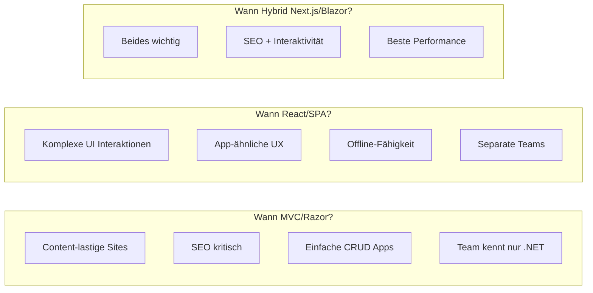

Im nächsten Kapitel werden wir JavaScript und TypeScript von Grund auf betrachten - mit besonderem Fokus auf die Unterschiede zu C#, die dich als .NET-Entwickler interessieren werden.

---

## Übungsaufgaben

1. **Vergleichsprojekt**: Erstelle eine einfache Todo-Liste einmal in ASP.NET MVC und einmal in React. Vergleiche die Entwicklungserfahrung.

2. **API Design**: Nimm einen bestehenden MVC Controller und konvertiere ihn zu einem REST API Controller (in .NET oder Express).

3. **State Management**: Baue eine Komponente mit lokalem State (z.B. ein Counter). Experimentiere mit useState und useEffect.

4. **Mental Model**: Zeichne den Datenfluss für einen "Produkt bearbeiten"-Vorgang in MVC und in React. Wo sind die Unterschiede?

---

*Im nächsten Kapitel: JavaScript & TypeScript für C#-Entwickler - Die Sprache verstehen*
