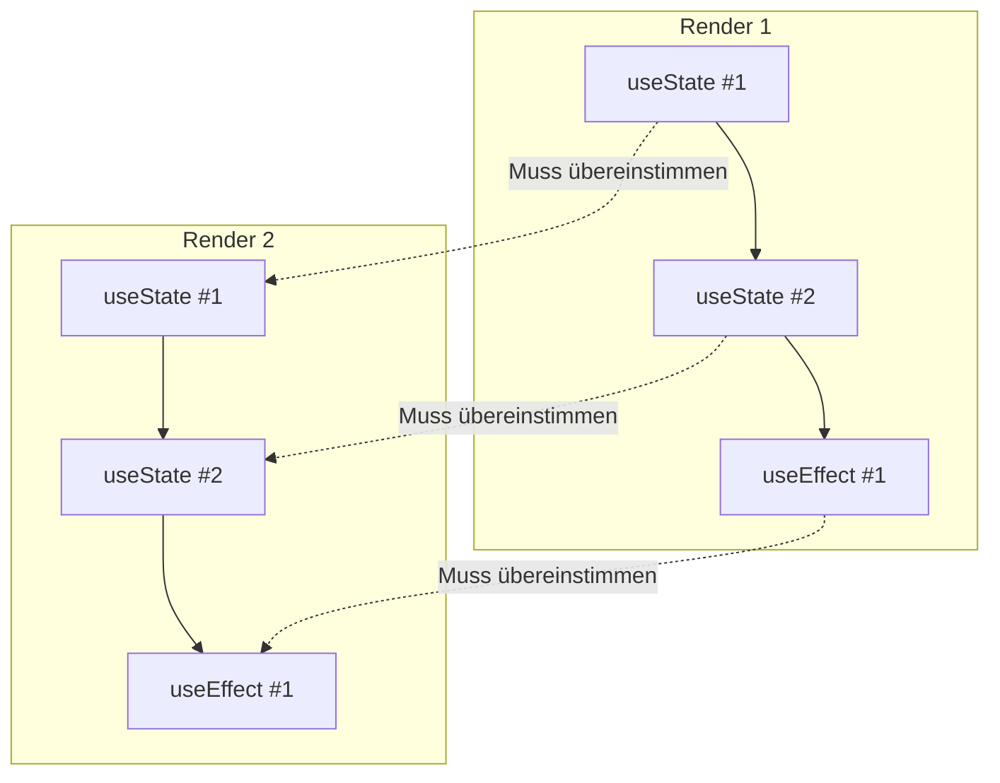
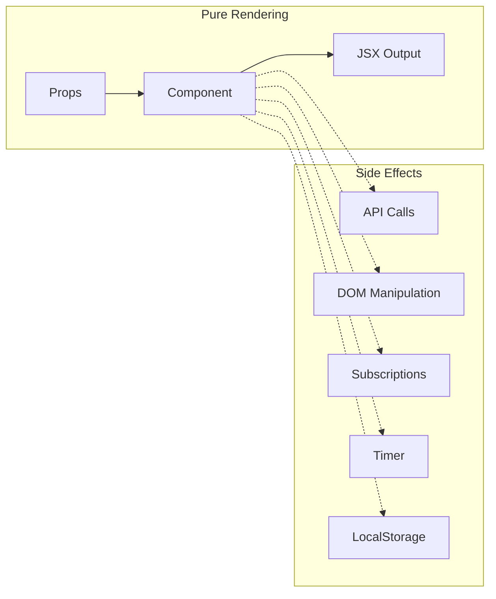
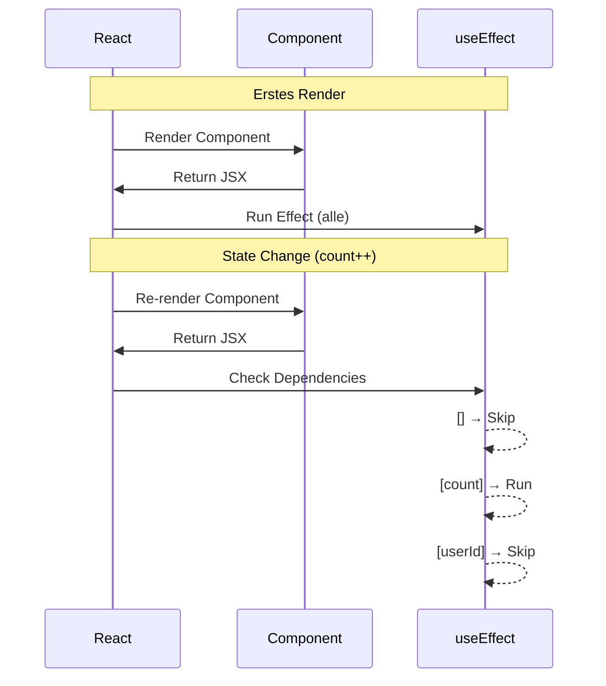
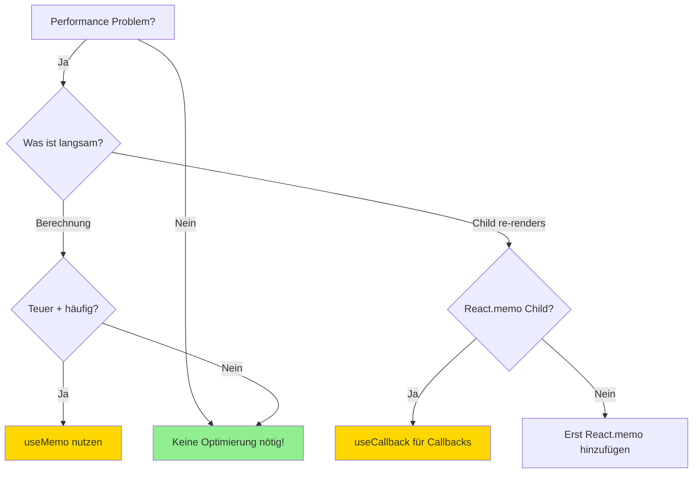
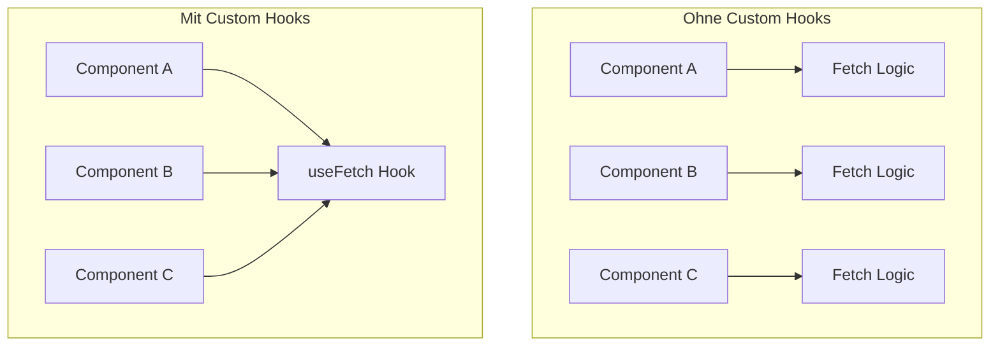
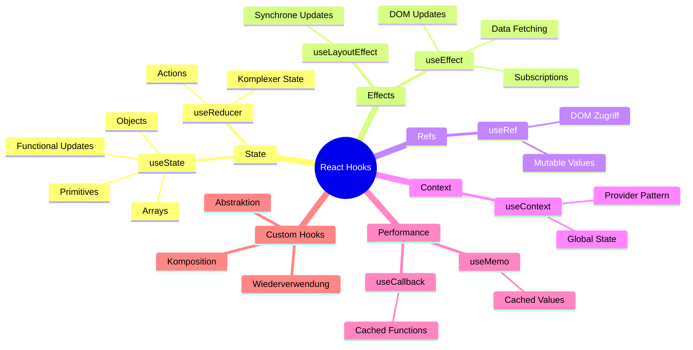

# Kapitel 5: React Hooks & State

## useState, useEffect und Custom Hooks für .NET-Entwickler

---

## 5.1 Was sind Hooks?

### Die Evolution: Von Class Components zu Hooks

Wenn du aus der .NET-Welt kommst, kennst du Klassen als fundamentalen Baustein. Bis React 16.8 (Februar 2019) war das in React genauso - State und Lifecycle-Methoden waren nur in Klassenkomponenten verfügbar:

```jsx
// ❌ Die alte Welt: Class Components
class Counter extends React.Component {
  constructor(props) {
    super(props);
    this.state = { count: 0 };
    this.handleClick = this.handleClick.bind(this);
  }

  componentDidMount() {
    document.title = `Count: ${this.state.count}`;
  }

  componentDidUpdate() {
    document.title = `Count: ${this.state.count}`;
  }

  handleClick() {
    this.setState({ count: this.state.count + 1 });
  }

  render() {
    return (
      <button onClick={this.handleClick}>
        Clicked {this.state.count} times
      </button>
    );
  }
}
```

Das war verbose, fehleranfällig (vergessenes `bind`) und machte Code-Wiederverwendung schwierig. Hooks lösten all diese Probleme:

```jsx
// ✅ Die moderne Welt: Function Components mit Hooks
function Counter() {
  const [count, setCount] = useState(0);

  useEffect(() => {
    document.title = `Count: ${count}`;
  }, [count]);

  return (
    <button onClick={() => setCount(count + 1)}>
      Clicked {count} times
    </button>
  );
}
```

### Für C#-Entwickler: Ein Paradigmenwechsel

```
┌─────────────────────────────────────────────────────────────────┐
│                    Konzeptvergleich                             │
├─────────────────────────────────────────────────────────────────┤
│  C# / .NET                    │  React Hooks                    │
├───────────────────────────────┼─────────────────────────────────┤
│  class MyViewModel            │  function MyComponent()         │
│  {                            │  {                              │
│    private int _count;        │    const [count, setCount]      │
│    public int Count           │      = useState(0);             │
│    {                          │                                 │
│      get => _count;           │    // Direkter Zugriff: count   │
│      set {                    │    // Änderung: setCount(n)     │
│        _count = value;        │                                 │
│        OnPropertyChanged();   │    // Re-render automatisch!    │
│      }                        │                                 │
│    }                          │                                 │
│  }                            │  }                              │
└───────────────────────────────┴─────────────────────────────────┘
```

### Die Rules of Hooks

React Hooks haben zwei eiserne Regeln, die du **niemals** brechen darfst:

```jsx
// ❌ REGEL 1: Hooks nur auf Top-Level
function BadComponent({ isLoggedIn }) {
  if (isLoggedIn) {
    const [user, setUser] = useState(null);  // VERBOTEN!
  }

  for (let i = 0; i < 3; i++) {
    useEffect(() => {});  // VERBOTEN!
  }
}

// ✅ KORREKT: Immer auf Top-Level
function GoodComponent({ isLoggedIn }) {
  const [user, setUser] = useState(null);  // Immer ausführen

  useEffect(() => {
    if (isLoggedIn) {
      // Bedingte Logik INNERHALB des Hooks
    }
  }, [isLoggedIn]);
}
```

```jsx
// ❌ REGEL 2: Hooks nur in React-Funktionen
function helperFunction() {
  const [state, setState] = useState(0);  // VERBOTEN!
}

// ✅ KORREKT: In Komponenten oder Custom Hooks
function MyComponent() {
  const [state, setState] = useState(0);  // OK
}

function useCustomHook() {  // "use" Präfix = Custom Hook
  const [state, setState] = useState(0);  // OK
}
```

**Warum diese Regeln?** React speichert Hook-Werte in einer Array-ähnlichen Struktur. Die Reihenfolge der Hook-Aufrufe muss bei jedem Render identisch sein:



---

## 5.2 useState - Der Grundbaustein

### Syntax und Grundkonzept

```jsx
const [state, setState] = useState(initialValue);
//     │       │                    │
//     │       │                    └── Startwert (nur beim ersten Render)
//     │       └── Funktion zum Aktualisieren
//     └── Aktueller Wert
```

### Primitives: Zahlen, Strings, Booleans

```jsx
function UserSettings() {
  // Verschiedene primitive Typen
  const [count, setCount] = useState(0);
  const [name, setName] = useState('');
  const [isActive, setIsActive] = useState(false);
  const [price, setPrice] = useState(19.99);

  return (
    <div>
      <p>Count: {count}</p>
      <button onClick={() => setCount(count + 1)}>+1</button>
      <button onClick={() => setCount(0)}>Reset</button>

      <input
        value={name}
        onChange={(e) => setName(e.target.value)}
        placeholder="Name eingeben"
      />

      <label>
        <input
          type="checkbox"
          checked={isActive}
          onChange={(e) => setIsActive(e.target.checked)}
        />
        Aktiv
      </label>
    </div>
  );
}
```

### Objects: Immutability ist Pflicht!

```jsx
function UserProfile() {
  const [user, setUser] = useState({
    name: 'Max',
    email: 'max@example.com',
    settings: {
      theme: 'dark',
      notifications: true
    }
  });

  // ❌ FALSCH: Direktes Mutieren
  const updateNameWrong = () => {
    user.name = 'Anna';  // React bemerkt keine Änderung!
    setUser(user);       // Gleiches Objekt = kein Re-render
  };

  // ✅ RICHTIG: Neues Objekt mit Spread
  const updateNameCorrect = () => {
    setUser({
      ...user,           // Alle bestehenden Properties kopieren
      name: 'Anna'       // Diese Property überschreiben
    });
  };

  // ✅ Verschachtelte Objects aktualisieren
  const updateTheme = (newTheme) => {
    setUser({
      ...user,
      settings: {
        ...user.settings,
        theme: newTheme
      }
    });
  };

  return (
    <div>
      <p>Name: {user.name}</p>
      <p>Theme: {user.settings.theme}</p>
      <button onClick={() => updateTheme('light')}>Light Mode</button>
    </div>
  );
}
```

### Arrays: Map, Filter, Spread

```jsx
function TodoList() {
  const [todos, setTodos] = useState([
    { id: 1, text: 'React lernen', done: false },
    { id: 2, text: 'Hooks verstehen', done: false }
  ]);

  // ✅ Element hinzufügen
  const addTodo = (text) => {
    setTodos([
      ...todos,
      { id: Date.now(), text, done: false }
    ]);
  };

  // ✅ Element entfernen
  const removeTodo = (id) => {
    setTodos(todos.filter(todo => todo.id !== id));
  };

  // ✅ Element aktualisieren
  const toggleTodo = (id) => {
    setTodos(todos.map(todo =>
      todo.id === id
        ? { ...todo, done: !todo.done }
        : todo
    ));
  };

  // ✅ Am Anfang einfügen
  const addTodoAtStart = (text) => {
    setTodos([
      { id: Date.now(), text, done: false },
      ...todos
    ]);
  };

  return (
    <ul>
      {todos.map(todo => (
        <li key={todo.id}>
          <input
            type="checkbox"
            checked={todo.done}
            onChange={() => toggleTodo(todo.id)}
          />
          {todo.text}
          <button onClick={() => removeTodo(todo.id)}>×</button>
        </li>
      ))}
    </ul>
  );
}
```

### Functional Updates: Wenn der vorherige Wert zählt

```jsx
function Counter() {
  const [count, setCount] = useState(0);

  // ❌ PROBLEM: Bei schnellen Klicks gehen Updates verloren
  const incrementWrong = () => {
    setCount(count + 1);  // Basiert auf "count" zum Zeitpunkt des Renders
    setCount(count + 1);  // Gleiches "count" → nur +1 insgesamt!
    setCount(count + 1);
  };

  // ✅ LÖSUNG: Functional Update
  const incrementCorrect = () => {
    setCount(prev => prev + 1);  // Basiert auf dem AKTUELLEN Wert
    setCount(prev => prev + 1);  // +1 auf das Ergebnis von oben
    setCount(prev => prev + 1);  // Ergebnis: +3 insgesamt
  };

  // ✅ Praktisches Beispiel: Async Operations
  const fetchAndIncrement = async () => {
    await someApiCall();
    // count könnte sich während des API-Calls geändert haben!
    setCount(prev => prev + 1);  // Immer korrekt
  };

  return (
    <div>
      <p>{count}</p>
      <button onClick={incrementCorrect}>+3</button>
    </div>
  );
}
```

### Vergleich zu C# INotifyPropertyChanged

```
┌─────────────────────────────────────────────────────────────────────────────┐
│                         State Management Vergleich                          │
├─────────────────────────────────────────────────────────────────────────────┤
│                                                                             │
│  C# WPF/MAUI ViewModel:                                                     │
│  ┌─────────────────────────────────────────────────────────────────────┐   │
│  │  public class CounterViewModel : INotifyPropertyChanged             │   │
│  │  {                                                                  │   │
│  │      private int _count;                                            │   │
│  │      public int Count                                               │   │
│  │      {                                                              │   │
│  │          get => _count;                                             │   │
│  │          set                                                        │   │
│  │          {                                                          │   │
│  │              if (_count != value)                                   │   │
│  │              {                                                      │   │
│  │                  _count = value;                                    │   │
│  │                  OnPropertyChanged(nameof(Count));  // Manuell!    │   │
│  │              }                                                      │   │
│  │          }                                                          │   │
│  │      }                                                              │   │
│  │  }                                                                  │   │
│  └─────────────────────────────────────────────────────────────────────┘   │
│                                                                             │
│  React useState:                                                            │
│  ┌─────────────────────────────────────────────────────────────────────┐   │
│  │  function Counter() {                                               │   │
│  │      const [count, setCount] = useState(0);                         │   │
│  │      // setCount() triggert automatisch Re-render                   │   │
│  │      // Kein manuelles "PropertyChanged" nötig!                     │   │
│  │  }                                                                  │   │
│  └─────────────────────────────────────────────────────────────────────┘   │
│                                                                             │
│  Vorteile React:                                                            │
│  • Weniger Boilerplate                                                      │
│  • Automatische UI-Updates                                                  │
│  • Keine Vererbung von Basisklassen nötig                                   │
│  • Immutability erzwingt sauberen Code                                      │
│                                                                             │
└─────────────────────────────────────────────────────────────────────────────┘
```

### Lazy Initialization

```jsx
// ❌ Teuer: Wird bei JEDEM Render ausgeführt
function ExpensiveComponent() {
  const [data, setData] = useState(expensiveCalculation());
}

// ✅ Lazy: Wird nur beim ERSTEN Render ausgeführt
function OptimizedComponent() {
  const [data, setData] = useState(() => expensiveCalculation());
}

// Praktisches Beispiel: LocalStorage
function usePersistentState(key, defaultValue) {
  const [state, setState] = useState(() => {
    const stored = localStorage.getItem(key);
    return stored ? JSON.parse(stored) : defaultValue;
  });

  // ... mehr dazu bei Custom Hooks
}
```

---

## 5.3 useEffect - Side Effects beherrschen

### Was sind Side Effects?



Side Effects sind alles, was außerhalb des reinen Renderings passiert:
- API-Aufrufe (fetch, axios)
- DOM-Manipulationen (document.title, focus)
- Subscriptions (WebSocket, Event Listener)
- Timer (setTimeout, setInterval)
- Storage (localStorage, sessionStorage)

### Grundsyntax

```jsx
useEffect(() => {
  // Effect-Code

  return () => {
    // Cleanup-Code (optional)
  };
}, [dependencies]);  // Dependency Array
```

### Das Dependency Array erklärt

```jsx
function DependencyExamples({ userId }) {
  const [count, setCount] = useState(0);

  // 1️⃣ KEIN Array: Läuft nach JEDEM Render
  useEffect(() => {
    console.log('Läuft nach jedem Render');
  });  // ⚠️ Vorsicht: Kann zu Performance-Problemen führen!

  // 2️⃣ Leeres Array []: Läuft NUR nach dem ERSTEN Render
  useEffect(() => {
    console.log('Läuft nur einmal - wie componentDidMount');
    fetchInitialData();
  }, []);

  // 3️⃣ Mit Dependencies: Läuft wenn sich Dependencies ändern
  useEffect(() => {
    console.log(`userId hat sich geändert: ${userId}`);
    fetchUserData(userId);
  }, [userId]);

  // 4️⃣ Mehrere Dependencies
  useEffect(() => {
    console.log('userId oder count hat sich geändert');
    trackEvent('state_change', { userId, count });
  }, [userId, count]);
}
```



### Cleanup Functions

Cleanup ist essentiell um Memory Leaks zu vermeiden:

```jsx
function ChatRoom({ roomId }) {
  const [messages, setMessages] = useState([]);

  useEffect(() => {
    // Setup: Subscription erstellen
    const connection = createConnection(roomId);
    connection.on('message', (msg) => {
      setMessages(prev => [...prev, msg]);
    });
    connection.connect();

    // Cleanup: Subscription beenden
    return () => {
      connection.disconnect();
    };
  }, [roomId]);  // Bei roomId-Wechsel: alte Verbindung trennen, neue aufbauen

  return <MessageList messages={messages} />;
}
```

```jsx
// Timer-Beispiel
function Countdown({ seconds }) {
  const [remaining, setRemaining] = useState(seconds);

  useEffect(() => {
    const intervalId = setInterval(() => {
      setRemaining(prev => {
        if (prev <= 1) {
          clearInterval(intervalId);
          return 0;
        }
        return prev - 1;
      });
    }, 1000);

    // Cleanup: Timer stoppen
    return () => clearInterval(intervalId);
  }, []);  // Nur einmal starten

  return <p>{remaining} Sekunden verbleibend</p>;
}
```

```jsx
// Event Listener Beispiel
function WindowSize() {
  const [size, setSize] = useState({
    width: window.innerWidth,
    height: window.innerHeight
  });

  useEffect(() => {
    const handleResize = () => {
      setSize({
        width: window.innerWidth,
        height: window.innerHeight
      });
    };

    window.addEventListener('resize', handleResize);

    // Cleanup: Event Listener entfernen
    return () => {
      window.removeEventListener('resize', handleResize);
    };
  }, []);

  return <p>Fenster: {size.width} x {size.height}</p>;
}
```

### Häufige Fehler und ihre Lösungen

#### Fehler 1: Infinite Loop

```jsx
// ❌ INFINITE LOOP!
function BadComponent() {
  const [data, setData] = useState([]);

  useEffect(() => {
    fetch('/api/data')
      .then(res => res.json())
      .then(data => setData(data));  // Setzt State → Re-render → Effect läuft wieder...
  });  // Kein Dependency Array!

  return <div>{data.length} items</div>;
}

// ✅ KORREKT
function GoodComponent() {
  const [data, setData] = useState([]);

  useEffect(() => {
    fetch('/api/data')
      .then(res => res.json())
      .then(data => setData(data));
  }, []);  // Leeres Array → nur einmal

  return <div>{data.length} items</div>;
}
```

#### Fehler 2: Object/Array als Dependency

```jsx
// ❌ INFINITE LOOP!
function BadComponent({ filters }) {
  const [results, setResults] = useState([]);

  useEffect(() => {
    fetchResults(filters).then(setResults);
  }, [filters]);  // Object! Neue Referenz bei jedem Render

  return <Results data={results} />;
}

// ✅ Lösung 1: Primitive Werte nutzen
function GoodComponent1({ category, sortBy }) {
  const [results, setResults] = useState([]);

  useEffect(() => {
    fetchResults({ category, sortBy }).then(setResults);
  }, [category, sortBy]);  // Primitive = stabil

  return <Results data={results} />;
}

// ✅ Lösung 2: JSON.stringify (Vorsicht bei großen Objects)
function GoodComponent2({ filters }) {
  const [results, setResults] = useState([]);
  const filtersJson = JSON.stringify(filters);

  useEffect(() => {
    fetchResults(JSON.parse(filtersJson)).then(setResults);
  }, [filtersJson]);

  return <Results data={results} />;
}
```

#### Fehler 3: Fehlende Dependency

```jsx
// ❌ Bug: count wird nie aktualisiert
function BadCounter() {
  const [count, setCount] = useState(0);

  useEffect(() => {
    const id = setInterval(() => {
      console.log(count);  // Immer 0! Closure über initialen Wert
    }, 1000);
    return () => clearInterval(id);
  }, []);  // count fehlt in Dependencies

  return <button onClick={() => setCount(c => c + 1)}>{count}</button>;
}

// ✅ Lösung: Functional Update oder Dependency
function GoodCounter() {
  const [count, setCount] = useState(0);

  useEffect(() => {
    const id = setInterval(() => {
      setCount(c => c + 1);  // Functional Update - braucht count nicht
    }, 1000);
    return () => clearInterval(id);
  }, []);

  return <p>{count}</p>;
}
```

### Vergleich zu ASP.NET Lifecycle Events

```
┌────────────────────────────────────────────────────────────────────────────┐
│                    Lifecycle Vergleich                                      │
├────────────────────────────────────────────────────────────────────────────┤
│                                                                            │
│  ASP.NET Page Lifecycle         │  React useEffect                         │
│  ──────────────────────────────│────────────────────────────────────────   │
│                                │                                           │
│  OnInit()                      │  useEffect(() => {...}, [])               │
│  └─ Initialisierung            │  └─ Einmalig nach Mount                   │
│                                │                                           │
│  OnLoad()                      │  useEffect(() => {...})                   │
│  └─ Bei jedem Request          │  └─ Nach jedem Render                     │
│                                │                                           │
│  OnPreRender()                 │  useLayoutEffect(() => {...})             │
│  └─ Vor dem Rendern            │  └─ Synchron vor Paint                    │
│                                │                                           │
│  Dispose()                     │  useEffect(() => {                        │
│  └─ Cleanup                    │      return () => {...}  // Cleanup       │
│                                │  }, [])                                   │
│                                │                                           │
├────────────────────────────────────────────────────────────────────────────┤
│                                                                            │
│  Blazor Lifecycle              │  React Entsprechung                       │
│  ──────────────────────────────│────────────────────────────────────────   │
│                                │                                           │
│  OnInitialized()               │  useState(() => {...})                    │
│  OnInitializedAsync()          │  useEffect(() => {...}, [])               │
│                                │                                           │
│  OnParametersSet()             │  useEffect(() => {...}, [param])          │
│  OnParametersSetAsync()        │                                           │
│                                │                                           │
│  OnAfterRender(firstRender)    │  useEffect(() => {                        │
│                                │    if (isFirstRender) {...}               │
│                                │  })                                       │
│                                │                                           │
│  IDisposable.Dispose()         │  Cleanup function                         │
│                                │                                           │
└────────────────────────────────────────────────────────────────────────────┘
```

### Data Fetching Pattern

```jsx
function UserProfile({ userId }) {
  const [user, setUser] = useState(null);
  const [loading, setLoading] = useState(true);
  const [error, setError] = useState(null);

  useEffect(() => {
    // Flag für Cleanup
    let cancelled = false;

    const fetchUser = async () => {
      setLoading(true);
      setError(null);

      try {
        const response = await fetch(`/api/users/${userId}`);
        if (!response.ok) throw new Error('User nicht gefunden');

        const data = await response.json();

        // Nur updaten wenn nicht cancelled
        if (!cancelled) {
          setUser(data);
          setLoading(false);
        }
      } catch (err) {
        if (!cancelled) {
          setError(err.message);
          setLoading(false);
        }
      }
    };

    fetchUser();

    // Cleanup: Verhindert State-Update nach Unmount
    return () => {
      cancelled = true;
    };
  }, [userId]);

  if (loading) return <Spinner />;
  if (error) return <Error message={error} />;
  if (!user) return null;

  return <UserCard user={user} />;
}
```

---

## 5.4 useRef - Persistente Referenzen

### DOM-Referenzen

```jsx
function TextInput() {
  const inputRef = useRef(null);

  const focusInput = () => {
    inputRef.current.focus();  // Direkter DOM-Zugriff
  };

  const selectAll = () => {
    inputRef.current.select();
  };

  return (
    <div>
      <input ref={inputRef} type="text" />
      <button onClick={focusInput}>Focus</button>
      <button onClick={selectAll}>Select All</button>
    </div>
  );
}
```

```jsx
// Video Player Kontrolle
function VideoPlayer({ src }) {
  const videoRef = useRef(null);

  const play = () => videoRef.current.play();
  const pause = () => videoRef.current.pause();
  const seekTo = (time) => { videoRef.current.currentTime = time; };

  return (
    <div>
      <video ref={videoRef} src={src} />
      <button onClick={play}>Play</button>
      <button onClick={pause}>Pause</button>
      <button onClick={() => seekTo(0)}>Restart</button>
    </div>
  );
}
```

### Persistente Werte ohne Re-render

```jsx
// useRef vs useState
function Comparison() {
  const [stateCount, setStateCount] = useState(0);
  const refCount = useRef(0);

  const incrementState = () => {
    setStateCount(s => s + 1);  // Löst Re-render aus!
  };

  const incrementRef = () => {
    refCount.current += 1;      // KEIN Re-render!
    console.log(refCount.current);
  };

  console.log('Render!');

  return (
    <div>
      <p>State: {stateCount}</p>
      <p>Ref: {refCount.current}</p>
      <button onClick={incrementState}>State++</button>
      <button onClick={incrementRef}>Ref++</button>
    </div>
  );
}
```

### Praktische Anwendungsfälle

```jsx
// Previous Value speichern
function usePrevious(value) {
  const ref = useRef();

  useEffect(() => {
    ref.current = value;
  }, [value]);

  return ref.current;  // Gibt vorherigen Wert zurück
}

function Counter() {
  const [count, setCount] = useState(0);
  const prevCount = usePrevious(count);

  return (
    <div>
      <p>Aktuell: {count}, Vorher: {prevCount}</p>
      <button onClick={() => setCount(c => c + 1)}>+1</button>
    </div>
  );
}
```

```jsx
// Timer-ID speichern
function Stopwatch() {
  const [time, setTime] = useState(0);
  const [isRunning, setIsRunning] = useState(false);
  const intervalRef = useRef(null);

  const start = () => {
    if (!isRunning) {
      setIsRunning(true);
      intervalRef.current = setInterval(() => {
        setTime(t => t + 1);
      }, 1000);
    }
  };

  const stop = () => {
    if (isRunning) {
      clearInterval(intervalRef.current);
      setIsRunning(false);
    }
  };

  const reset = () => {
    stop();
    setTime(0);
  };

  useEffect(() => {
    return () => clearInterval(intervalRef.current);
  }, []);

  return (
    <div>
      <p>{time} Sekunden</p>
      <button onClick={start}>Start</button>
      <button onClick={stop}>Stop</button>
      <button onClick={reset}>Reset</button>
    </div>
  );
}
```

---

## 5.5 useMemo & useCallback - Performance-Optimierung

### useMemo: Berechnete Werte cachen

```jsx
function ProductList({ products, filter }) {
  // ❌ Ohne useMemo: Filtert bei JEDEM Render
  const filteredProducts = products.filter(p =>
    p.name.toLowerCase().includes(filter.toLowerCase())
  );

  // ✅ Mit useMemo: Filtert nur wenn sich products oder filter ändern
  const filteredProductsMemo = useMemo(() => {
    console.log('Filtering...');
    return products.filter(p =>
      p.name.toLowerCase().includes(filter.toLowerCase())
    );
  }, [products, filter]);

  return (
    <ul>
      {filteredProductsMemo.map(p => (
        <li key={p.id}>{p.name}</li>
      ))}
    </ul>
  );
}
```

### useCallback: Funktionen cachen

```jsx
function ParentComponent() {
  const [count, setCount] = useState(0);
  const [text, setText] = useState('');

  // ❌ Ohne useCallback: Neue Funktion bei jedem Render
  const handleClick = () => {
    setCount(c => c + 1);
  };

  // ✅ Mit useCallback: Gleiche Funktion wenn Dependencies stabil
  const handleClickMemo = useCallback(() => {
    setCount(c => c + 1);
  }, []);  // Keine Dependencies → immer gleiche Funktion

  return (
    <div>
      <input value={text} onChange={e => setText(e.target.value)} />
      {/* Button re-rendert nicht bei Text-Änderung */}
      <ExpensiveChild onClick={handleClickMemo} />
    </div>
  );
}

const ExpensiveChild = React.memo(({ onClick }) => {
  console.log('ExpensiveChild rendered');
  return <button onClick={onClick}>Click me</button>;
});
```

### Wann sind sie wirklich nötig?



**Faustregel: Premature optimization is the root of all evil!**

```jsx
// ❌ Overengineering: Nicht nötig für einfache Berechnungen
function BadExample({ items }) {
  const total = useMemo(() => items.length, [items]);  // Unnötig!
  const double = useMemo(() => 2 * 2, []);  // Lächerlich!
}

// ✅ Sinnvoll: Bei teuren Operationen
function GoodExample({ items }) {
  const sortedItems = useMemo(() => {
    return [...items].sort((a, b) => {
      // Komplexe Sortierlogik
      return complexComparison(a, b);
    });
  }, [items]);

  const statistics = useMemo(() => {
    return items.reduce((acc, item) => {
      // Aufwändige Berechnungen
      return computeStatistics(acc, item);
    }, initialStats);
  }, [items]);
}
```

---

## 5.6 useContext - Global State ohne Props

### Das Problem: Prop Drilling

```jsx
// ❌ Prop Drilling Hell
function App() {
  const [theme, setTheme] = useState('dark');
  return <Layout theme={theme} setTheme={setTheme} />;
}

function Layout({ theme, setTheme }) {
  return <Sidebar theme={theme} setTheme={setTheme} />;
}

function Sidebar({ theme, setTheme }) {
  return <UserMenu theme={theme} setTheme={setTheme} />;
}

function UserMenu({ theme, setTheme }) {
  // Endlich brauchen wir es hier!
  return <ThemeToggle theme={theme} setTheme={setTheme} />;
}
```

### Die Lösung: Context

```jsx
// 1. Context erstellen
const ThemeContext = createContext(null);

// 2. Provider komponente
function ThemeProvider({ children }) {
  const [theme, setTheme] = useState('dark');

  const value = {
    theme,
    setTheme,
    toggleTheme: () => setTheme(t => t === 'dark' ? 'light' : 'dark')
  };

  return (
    <ThemeContext.Provider value={value}>
      {children}
    </ThemeContext.Provider>
  );
}

// 3. Custom Hook für einfache Nutzung
function useTheme() {
  const context = useContext(ThemeContext);
  if (!context) {
    throw new Error('useTheme must be used within ThemeProvider');
  }
  return context;
}

// 4. Verwendung - kein Prop Drilling!
function App() {
  return (
    <ThemeProvider>
      <Layout />
    </ThemeProvider>
  );
}

function Layout() {
  return <Sidebar />;  // Keine Props!
}

function Sidebar() {
  return <UserMenu />;  // Keine Props!
}

function ThemeToggle() {
  const { theme, toggleTheme } = useTheme();  // Direkter Zugriff!

  return (
    <button onClick={toggleTheme}>
      Current: {theme}
    </button>
  );
}
```

### Mehrere Contexts kombinieren

```jsx
// Auth Context
const AuthContext = createContext(null);

function AuthProvider({ children }) {
  const [user, setUser] = useState(null);

  const login = async (credentials) => {
    const user = await authApi.login(credentials);
    setUser(user);
  };

  const logout = () => setUser(null);

  return (
    <AuthContext.Provider value={{ user, login, logout }}>
      {children}
    </AuthContext.Provider>
  );
}

// Notification Context
const NotificationContext = createContext(null);

function NotificationProvider({ children }) {
  const [notifications, setNotifications] = useState([]);

  const addNotification = (message, type = 'info') => {
    const id = Date.now();
    setNotifications(prev => [...prev, { id, message, type }]);
    setTimeout(() => removeNotification(id), 5000);
  };

  const removeNotification = (id) => {
    setNotifications(prev => prev.filter(n => n.id !== id));
  };

  return (
    <NotificationContext.Provider value={{ notifications, addNotification }}>
      {children}
    </NotificationContext.Provider>
  );
}

// App mit allen Providern
function App() {
  return (
    <AuthProvider>
      <NotificationProvider>
        <ThemeProvider>
          <Router>
            <MainApp />
          </Router>
        </ThemeProvider>
      </NotificationProvider>
    </AuthProvider>
  );
}
```

---

## 5.7 Custom Hooks - Logik extrahieren und wiederverwenden

### Warum Custom Hooks?

Custom Hooks ermöglichen das Extrahieren von wiederverwendbarer Stateful-Logik:



### Beispiel 1: useLocalStorage

```jsx
function useLocalStorage(key, initialValue) {
  // Lazy Initialization aus localStorage
  const [storedValue, setStoredValue] = useState(() => {
    try {
      const item = localStorage.getItem(key);
      return item ? JSON.parse(item) : initialValue;
    } catch (error) {
      console.error(`Error reading localStorage key "${key}":`, error);
      return initialValue;
    }
  });

  // Wrapper um setState der auch localStorage aktualisiert
  const setValue = (value) => {
    try {
      // Erlaubt functional updates wie bei useState
      const valueToStore = value instanceof Function
        ? value(storedValue)
        : value;

      setStoredValue(valueToStore);
      localStorage.setItem(key, JSON.stringify(valueToStore));
    } catch (error) {
      console.error(`Error setting localStorage key "${key}":`, error);
    }
  };

  return [storedValue, setValue];
}

// Verwendung
function Settings() {
  const [theme, setTheme] = useLocalStorage('theme', 'dark');
  const [fontSize, setFontSize] = useLocalStorage('fontSize', 16);

  return (
    <div>
      <select value={theme} onChange={e => setTheme(e.target.value)}>
        <option value="dark">Dark</option>
        <option value="light">Light</option>
      </select>
      <input
        type="range"
        min="12"
        max="24"
        value={fontSize}
        onChange={e => setFontSize(Number(e.target.value))}
      />
    </div>
  );
}
```

### Beispiel 2: useFetch

```jsx
function useFetch(url, options = {}) {
  const [data, setData] = useState(null);
  const [loading, setLoading] = useState(true);
  const [error, setError] = useState(null);

  useEffect(() => {
    let cancelled = false;
    const controller = new AbortController();

    const fetchData = async () => {
      setLoading(true);
      setError(null);

      try {
        const response = await fetch(url, {
          ...options,
          signal: controller.signal
        });

        if (!response.ok) {
          throw new Error(`HTTP error! status: ${response.status}`);
        }

        const json = await response.json();

        if (!cancelled) {
          setData(json);
          setLoading(false);
        }
      } catch (err) {
        if (!cancelled && err.name !== 'AbortError') {
          setError(err.message);
          setLoading(false);
        }
      }
    };

    fetchData();

    return () => {
      cancelled = true;
      controller.abort();
    };
  }, [url]);

  return { data, loading, error };
}

// Verwendung
function UserList() {
  const { data: users, loading, error } = useFetch('/api/users');

  if (loading) return <Spinner />;
  if (error) return <Error message={error} />;

  return (
    <ul>
      {users.map(user => (
        <li key={user.id}>{user.name}</li>
      ))}
    </ul>
  );
}
```

### Beispiel 3: useDebounce

```jsx
function useDebounce(value, delay = 300) {
  const [debouncedValue, setDebouncedValue] = useState(value);

  useEffect(() => {
    const timer = setTimeout(() => {
      setDebouncedValue(value);
    }, delay);

    return () => clearTimeout(timer);
  }, [value, delay]);

  return debouncedValue;
}

// Verwendung: Suchfeld
function SearchInput() {
  const [searchTerm, setSearchTerm] = useState('');
  const debouncedSearch = useDebounce(searchTerm, 500);

  const { data: results } = useFetch(
    debouncedSearch ? `/api/search?q=${debouncedSearch}` : null
  );

  return (
    <div>
      <input
        value={searchTerm}
        onChange={e => setSearchTerm(e.target.value)}
        placeholder="Suchen..."
      />
      {results && <SearchResults results={results} />}
    </div>
  );
}
```

### Beispiel 4: useToggle

```jsx
function useToggle(initialValue = false) {
  const [value, setValue] = useState(initialValue);

  const toggle = useCallback(() => setValue(v => !v), []);
  const setTrue = useCallback(() => setValue(true), []);
  const setFalse = useCallback(() => setValue(false), []);

  return { value, toggle, setTrue, setFalse };
}

// Verwendung
function Modal() {
  const { value: isOpen, toggle, setFalse: close } = useToggle();

  return (
    <div>
      <button onClick={toggle}>Toggle Modal</button>
      {isOpen && (
        <div className="modal">
          <h2>Modal Content</h2>
          <button onClick={close}>Close</button>
        </div>
      )}
    </div>
  );
}
```

### Beispiel 5: useOnClickOutside

```jsx
function useOnClickOutside(ref, handler) {
  useEffect(() => {
    const listener = (event) => {
      // Nichts tun wenn Klick auf das Element selbst
      if (!ref.current || ref.current.contains(event.target)) {
        return;
      }
      handler(event);
    };

    document.addEventListener('mousedown', listener);
    document.addEventListener('touchstart', listener);

    return () => {
      document.removeEventListener('mousedown', listener);
      document.removeEventListener('touchstart', listener);
    };
  }, [ref, handler]);
}

// Verwendung: Dropdown
function Dropdown() {
  const [isOpen, setIsOpen] = useState(false);
  const dropdownRef = useRef(null);

  useOnClickOutside(dropdownRef, () => setIsOpen(false));

  return (
    <div ref={dropdownRef}>
      <button onClick={() => setIsOpen(!isOpen)}>Menu</button>
      {isOpen && (
        <ul className="dropdown-menu">
          <li>Option 1</li>
          <li>Option 2</li>
          <li>Option 3</li>
        </ul>
      )}
    </div>
  );
}
```

### Aus HausTracker: useStore Hook analysieren

Ein typisches Pattern für State Management in React-Anwendungen:

```jsx
// stores/useStore.js - Zentraler Store mit Zustand
import { create } from 'zustand';
import { persist } from 'zustand/middleware';

export const useStore = create(
  persist(
    (set, get) => ({
      // State
      rooms: [],
      inventory: [],
      isLoading: false,
      error: null,

      // Actions für Rooms
      setRooms: (rooms) => set({ rooms }),

      addRoom: (room) => set((state) => ({
        rooms: [...state.rooms, { ...room, id: Date.now() }]
      })),

      updateRoom: (id, updates) => set((state) => ({
        rooms: state.rooms.map(room =>
          room.id === id ? { ...room, ...updates } : room
        )
      })),

      deleteRoom: (id) => set((state) => ({
        rooms: state.rooms.filter(room => room.id !== id)
      })),

      // Actions für Inventory
      addInventoryItem: (item) => set((state) => ({
        inventory: [...state.inventory, {
          ...item,
          id: Date.now(),
          createdAt: new Date().toISOString()
        }]
      })),

      // Computed Values (Selectors)
      getRoomById: (id) => get().rooms.find(r => r.id === id),

      getItemsByRoom: (roomId) =>
        get().inventory.filter(item => item.roomId === roomId),

      getTotalValue: () =>
        get().inventory.reduce((sum, item) => sum + (item.value || 0), 0),

      // Async Actions
      fetchRooms: async () => {
        set({ isLoading: true, error: null });
        try {
          const response = await fetch('/api/rooms');
          const rooms = await response.json();
          set({ rooms, isLoading: false });
        } catch (error) {
          set({ error: error.message, isLoading: false });
        }
      }
    }),
    {
      name: 'hausTracker-storage',  // LocalStorage key
      partialize: (state) => ({     // Nur diese Felder persistieren
        rooms: state.rooms,
        inventory: state.inventory
      })
    }
  )
);

// Verwendung in Komponenten
function RoomList() {
  const rooms = useStore((state) => state.rooms);
  const addRoom = useStore((state) => state.addRoom);
  const isLoading = useStore((state) => state.isLoading);

  if (isLoading) return <Spinner />;

  return (
    <div>
      {rooms.map(room => (
        <RoomCard key={room.id} room={room} />
      ))}
      <button onClick={() => addRoom({ name: 'Neuer Raum' })}>
        Raum hinzufügen
      </button>
    </div>
  );
}

function InventorySummary() {
  const totalValue = useStore((state) => state.getTotalValue());
  const itemCount = useStore((state) => state.inventory.length);

  return (
    <div className="summary">
      <p>{itemCount} Gegenstände</p>
      <p>Gesamtwert: {totalValue.toFixed(2)} €</p>
    </div>
  );
}
```

---

## 5.8 Best Practices

### Hooks Komposition

```jsx
// ✅ Kleine, fokussierte Hooks kombinieren
function useUser(userId) {
  const { data: user, loading, error } = useFetch(`/api/users/${userId}`);
  return { user, loading, error };
}

function useUserPosts(userId) {
  const { data: posts, loading, error } = useFetch(`/api/users/${userId}/posts`);
  return { posts, loading, error };
}

function useUserWithPosts(userId) {
  const { user, loading: userLoading } = useUser(userId);
  const { posts, loading: postsLoading } = useUserPosts(userId);

  return {
    user,
    posts,
    loading: userLoading || postsLoading
  };
}

// Verwendung
function UserProfile({ userId }) {
  const { user, posts, loading } = useUserWithPosts(userId);
  // ...
}
```

### State-Struktur: Flach vs. Verschachtelt

```jsx
// ❌ Zu verschachtelt - schwer zu aktualisieren
const [state, setState] = useState({
  user: {
    profile: {
      name: 'Max',
      address: {
        street: 'Hauptstr.',
        city: 'Berlin',
        country: {
          code: 'DE',
          name: 'Deutschland'
        }
      }
    }
  }
});

// ✅ Flache Struktur - einfach zu aktualisieren
const [userName, setUserName] = useState('Max');
const [street, setStreet] = useState('Hauptstr.');
const [city, setCity] = useState('Berlin');
const [countryCode, setCountryCode] = useState('DE');

// ✅ Oder: Verwandte Daten gruppieren
const [user, setUser] = useState({ name: 'Max' });
const [address, setAddress] = useState({
  street: 'Hauptstr.',
  city: 'Berlin'
});
const [country, setCountry] = useState({ code: 'DE' });
```

### Vermeidung häufiger Fehler

```jsx
// 1. ❌ State für abgeleitete Werte
function BadComponent({ items }) {
  const [filteredItems, setFilteredItems] = useState([]);
  const [filter, setFilter] = useState('');

  useEffect(() => {
    setFilteredItems(items.filter(i => i.name.includes(filter)));
  }, [items, filter]);
}

// ✅ Berechnen statt speichern
function GoodComponent({ items }) {
  const [filter, setFilter] = useState('');
  const filteredItems = items.filter(i => i.name.includes(filter));
}

// 2. ❌ Object/Array als Dependency ohne Memoization
function BadComponent({ config }) {  // config = { a: 1, b: 2 }
  useEffect(() => {
    // Läuft bei jedem Render!
  }, [config]);  // Neue Referenz jedes Mal
}

// 3. ❌ Stale Closure
function BadTimer() {
  const [count, setCount] = useState(0);

  useEffect(() => {
    const id = setInterval(() => {
      console.log(count);  // Immer 0!
    }, 1000);
    return () => clearInterval(id);
  }, []);
}

// ✅ useRef für aktuelle Werte
function GoodTimer() {
  const [count, setCount] = useState(0);
  const countRef = useRef(count);
  countRef.current = count;

  useEffect(() => {
    const id = setInterval(() => {
      console.log(countRef.current);  // Aktueller Wert!
    }, 1000);
    return () => clearInterval(id);
  }, []);
}
```

### Checkliste für Hook-Nutzung

```
┌─────────────────────────────────────────────────────────────────┐
│                    React Hooks Checkliste                       │
├─────────────────────────────────────────────────────────────────┤
│                                                                 │
│  useState:                                                      │
│  □ Initialer Wert sinnvoll gewählt?                            │
│  □ Lazy Initialization für teure Berechnungen?                  │
│  □ Immutability bei Objects/Arrays beachtet?                    │
│  □ Functional Updates bei abhängigen Updates?                   │
│                                                                 │
│  useEffect:                                                     │
│  □ Dependency Array korrekt und vollständig?                    │
│  □ Cleanup Function für Subscriptions/Timer?                    │
│  □ Race Conditions bei Async-Operationen behandelt?             │
│  □ Keine Infinite Loops möglich?                                │
│                                                                 │
│  useRef:                                                        │
│  □ Für DOM-Zugriff oder persistente Werte genutzt?             │
│  □ Nicht für Werte die Re-render triggern sollen?              │
│                                                                 │
│  useMemo/useCallback:                                           │
│  □ Wirklich Performance-Problem vorhanden?                      │
│  □ Dependencies korrekt?                                        │
│  □ Nicht überoptimiert?                                         │
│                                                                 │
│  Custom Hooks:                                                  │
│  □ Name beginnt mit "use"?                                      │
│  □ Wiederverwendbare Logik extrahiert?                         │
│  □ Dokumentation vorhanden?                                     │
│                                                                 │
└─────────────────────────────────────────────────────────────────┘
```

---

## Zusammenfassung



**Key Takeaways für .NET-Entwickler:**

1. **useState** ersetzt INotifyPropertyChanged - automatisches Re-rendering
2. **useEffect** kombiniert mehrere Lifecycle-Events - Dependency Array ist der Schlüssel
3. **Immutability** ist nicht optional - immer neue Objekte/Arrays erstellen
4. **Custom Hooks** sind wie Extension Methods - Logik extrahieren und wiederverwenden
5. **Performance-Optimierung** nur wenn nötig - React ist bereits schnell

Im nächsten Kapitel schauen wir uns **Routing mit React Router** an - wie du Multi-Page-Feeling in deiner Single-Page-Application erreichst.
