# Kapitel 13: Full-Stack Architektur - Wie alles zusammenspielt

Nach zwölf Kapiteln, in denen wir Frontend und Backend separat betrachtet haben, ist es Zeit für das große Ganze. Wie orchestrieren wir alle Teile zu einer funktionierenden Anwendung? Dieses Kapitel zeigt dir den kompletten Datenfluss von der Datenbank bis zum Pixel auf dem Bildschirm.

---

## 13.1 Das Big Picture

### Die Gesamtarchitektur

Bevor wir ins Detail gehen, hier die Vogelperspektive unserer HausTracker-Anwendung:


### Vergleich: .NET Full-Stack Architektur


**Der fundamentale Unterschied:**

| Aspekt | .NET MVC | React + Express |
|--------|----------|-----------------|
| View-Rendering | Server-side (Razor) | Client-side (React) |
| State Management | ViewBag, Session, TempData | Zustand, React State |
| Daten-Binding | Model Binding | JSON über fetch |
| Type Safety | C# durchgängig | TypeScript (separierte Projekte) |
| Hot Reload | Partial (Runtime) | Full (Vite HMR) |

---

### Der Request-Lifecycle: Von Button bis Datenbank und zurück

Stellen wir uns vor, ein Benutzer klickt auf "Aufgabe erstellen". Was passiert?

```mermaid
sequenceDiagram
    participant User as 👤 User
    participant React as ⚛️ React Component
    participant Store as 🗄️ Zustand Store
    participant Fetch as 🌐 fetch()
    participant Express as 🚂 Express
    participant Route as 📍 Route Handler
    participant Service as ⚙️ Service
    participant DB as 🗃️ SQLite

    User->>React: Click "Erstellen"
    React->>Store: createTask(data)

    Note over Store: Optimistic Update
    Store->>React: UI aktualisiert (pending)

    Store->>Fetch: POST /api/tasks
    Fetch->>Express: HTTP Request
    Express->>Route: Route Matching
    Route->>Service: Business Logic
    Service->>DB: INSERT INTO tasks
    DB-->>Service: lastInsertRowid
    Service-->>Route: Task Object
    Route-->>Express: JSON Response
    Express-->>Fetch: 201 Created
    Fetch-->>Store: Response Data

    Note over Store: State Reconciliation
    Store->>React: Final UI Update
    React->>User: ✅ Task erstellt
```



**In .NET wäre der Ablauf ähnlich:**

```mermaid
sequenceDiagram
    participant User as 👤 User
    participant View as 📄 Razor View
    participant Controller as 🎮 Controller
    participant Service as ⚙️ Service
    participant EF as 📦 EF Core
    participant DB as 🗃️ SQL Server

    User->>View: Submit Form
    View->>Controller: POST /Tasks/Create
    Controller->>Service: CreateTask(dto)
    Service->>EF: DbContext.Add()
    EF->>DB: INSERT
    DB-->>EF: Identity
    EF-->>Service: Entity
    Service-->>Controller: Task
    Controller-->>View: RedirectToAction / JSON
    View-->>User: Neue Seite / Update
```



---

## 13.2 Projektstruktur

### Monorepo vs Separate Repositories

Es gibt zwei gängige Ansätze für Full-Stack TypeScript-Projekte:


**Vorteile Monorepo:**
- Ein `git clone` für alles
- Shared Types ohne npm publish
- Einheitliche Versionierung
- Einfacheres Refactoring

**Vorteile Separate Repos:**
- Unabhängige Deployments
- Separate CI/CD Pipelines
- Team-Autonomie
- Skaliert besser bei großen Teams

### Die HausTracker Ordnerstruktur

```
haustracker/
├── client/                    # React Frontend (Vite)
│   ├── src/
│   │   ├── components/        # Wiederverwendbare UI-Komponenten
│   │   │   ├── common/        # Buttons, Inputs, Cards
│   │   │   ├── layout/        # Header, Sidebar, Layout
│   │   │   └── features/      # Feature-spezifische Komponenten
│   │   ├── pages/             # Seiten-Komponenten (Routes)
│   │   ├── stores/            # Zustand Stores
│   │   ├── hooks/             # Custom React Hooks
│   │   ├── services/          # API-Client Funktionen
│   │   ├── types/             # Frontend-spezifische Types
│   │   └── utils/             # Helper-Funktionen
│   ├── public/                # Statische Assets
│   ├── index.html
│   ├── vite.config.ts
│   ├── tailwind.config.js
│   └── package.json
│
├── server/                    # Express Backend
│   ├── src/
│   │   ├── routes/            # API Route Definitions
│   │   ├── services/          # Business Logic
│   │   ├── db/                # Datenbank-Konfiguration
│   │   │   ├── index.ts       # DB Connection
│   │   │   ├── schema.sql     # DDL Statements
│   │   │   └── migrations/    # Schema-Änderungen
│   │   ├── middleware/        # Express Middleware
│   │   ├── types/             # Backend-spezifische Types
│   │   └── utils/             # Server Utilities
│   ├── data/                  # SQLite Datenbank-Dateien
│   └── package.json
│
├── shared/                    # Gemeinsame Typen
│   └── types/
│       ├── task.ts
│       ├── api.ts
│       └── index.ts
│
├── docs/                      # Dokumentation
│   └── book/                  # Dieses Buch!
│
└── package.json               # Root package.json (Workspace)
```

### Workspace-Konfiguration

Die Root `package.json` definiert das Monorepo:

```json
{
  "name": "haustracker",
  "private": true,
  "workspaces": [
    "client",
    "server",
    "shared"
  ],
  "scripts": {
    "dev": "concurrently \"npm run dev:server\" \"npm run dev:client\"",
    "dev:client": "npm run dev --workspace=client",
    "dev:server": "npm run dev --workspace=server",
    "build": "npm run build --workspaces",
    "test": "npm run test --workspaces --if-present"
  },
  "devDependencies": {
    "concurrently": "^8.2.0",
    "typescript": "^5.3.0"
  }
}
```

**Vergleich zu .NET Solution-Struktur:**

```
HausTracker.sln
├── src/
│   ├── HausTracker.Web/           # ASP.NET Core Projekt
│   ├── HausTracker.Application/   # Business Logic
│   ├── HausTracker.Domain/        # Entities, Interfaces
│   └── HausTracker.Infrastructure/ # EF Core, External Services
├── tests/
│   ├── HausTracker.UnitTests/
│   └── HausTracker.IntegrationTests/
└── Directory.Build.props          # Shared Build Settings
```

**Die Parallelen:**
- `shared/` ≈ `HausTracker.Domain` (gemeinsame Typen)
- `server/services/` ≈ `HausTracker.Application` (Business Logic)
- `server/db/` ≈ `HausTracker.Infrastructure` (Datenzugriff)
- `client/` ≈ Separates Frontend-Projekt

---

## 13.3 Datenfluss im Detail

### Die komplette Reise der Daten

Verfolgen wir einen Task vom Laden bis zur Anzeige:


### Schritt für Schritt mit Code

#### Schritt 1: Datenbank (SQLite)

```sql
-- Die Daten liegen in der SQLite-Datei
-- Tabellen-Definition
CREATE TABLE tasks (
    id INTEGER PRIMARY KEY AUTOINCREMENT,
    title TEXT NOT NULL,
    description TEXT,
    status TEXT DEFAULT 'pending',
    priority INTEGER DEFAULT 0,
    due_date TEXT,
    created_at TEXT DEFAULT CURRENT_TIMESTAMP,
    updated_at TEXT DEFAULT CURRENT_TIMESTAMP
);

-- Beispiel-Daten
INSERT INTO tasks (title, description, status)
VALUES ('Heizung warten', 'Jährliche Wartung', 'pending');
```

#### Schritt 2: Datenzugriff (better-sqlite3)

```typescript
// server/src/db/index.ts
import Database from 'better-sqlite3';
import path from 'path';

const db = new Database(path.join(__dirname, '../../data/haustracker.db'));

// Synchrone API - kein await nötig!
export function getTaskById(id: number): Task | undefined {
    const stmt = db.prepare('SELECT * FROM tasks WHERE id = ?');
    return stmt.get(id) as Task | undefined;
}

// Vergleich zu EF Core:
// var task = await dbContext.Tasks.FindAsync(id);
```

#### Schritt 3: Service Layer

```typescript
// server/src/services/taskService.ts
import { getTaskById, getAllTasks } from '../db';
import type { Task, TaskDTO } from '@shared/types';

export class TaskService {
    findById(id: number): TaskDTO | null {
        const task = getTaskById(id);

        if (!task) return null;

        // Transformation: DB-Row → DTO
        return {
            id: task.id,
            title: task.title,
            description: task.description ?? '',
            status: task.status as TaskStatus,
            priority: task.priority,
            dueDate: task.due_date ? new Date(task.due_date) : null,
            createdAt: new Date(task.created_at),
            updatedAt: new Date(task.updated_at)
        };
    }

    // In .NET:
    // public async Task<TaskDto?> FindByIdAsync(int id) {
    //     var entity = await _context.Tasks.FindAsync(id);
    //     return entity is null ? null : _mapper.Map<TaskDto>(entity);
    // }
}
```

#### Schritt 4: Route Handler

```typescript
// server/src/routes/tasks.ts
import { Router, Request, Response } from 'express';
import { TaskService } from '../services/taskService';

const router = Router();
const taskService = new TaskService();

router.get('/:id', (req: Request, res: Response) => {
    const id = parseInt(req.params.id, 10);

    if (isNaN(id)) {
        return res.status(400).json({ error: 'Invalid ID' });
    }

    const task = taskService.findById(id);

    if (!task) {
        return res.status(404).json({ error: 'Task not found' });
    }

    res.json(task);
});

export default router;

// In .NET:
// [HttpGet("{id}")]
// public async Task<ActionResult<TaskDto>> GetById(int id) {
//     var task = await _taskService.FindByIdAsync(id);
//     return task is null ? NotFound() : Ok(task);
// }
```

#### Schritt 5: HTTP Response

```http
HTTP/1.1 200 OK
Content-Type: application/json
X-Response-Time: 12ms

{
    "id": 1,
    "title": "Heizung warten",
    "description": "Jährliche Wartung",
    "status": "pending",
    "priority": 0,
    "dueDate": null,
    "createdAt": "2024-01-15T10:30:00.000Z",
    "updatedAt": "2024-01-15T10:30:00.000Z"
}
```

#### Schritt 6: Client Fetch

```typescript
// client/src/services/api.ts
const API_BASE = '/api';

export async function fetchTask(id: number): Promise<TaskDTO> {
    const response = await fetch(`${API_BASE}/tasks/${id}`);

    if (!response.ok) {
        const error = await response.json();
        throw new ApiError(response.status, error.message);
    }

    return response.json();
}

// Mit Typisierung für Request und Response
export async function createTask(data: CreateTaskDTO): Promise<TaskDTO> {
    const response = await fetch(`${API_BASE}/tasks`, {
        method: 'POST',
        headers: { 'Content-Type': 'application/json' },
        body: JSON.stringify(data)
    });

    if (!response.ok) {
        throw new ApiError(response.status, 'Failed to create task');
    }

    return response.json();
}
```

#### Schritt 7: Zustand Store

```typescript
// client/src/stores/taskStore.ts
import { create } from 'zustand';
import { fetchTask, fetchTasks, createTask } from '../services/api';
import type { TaskDTO, CreateTaskDTO } from '@shared/types';

interface TaskState {
    // State
    tasks: TaskDTO[];
    currentTask: TaskDTO | null;
    isLoading: boolean;
    error: string | null;

    // Actions
    loadTasks: () => Promise<void>;
    loadTask: (id: number) => Promise<void>;
    addTask: (data: CreateTaskDTO) => Promise<void>;
}

export const useTaskStore = create<TaskState>((set, get) => ({
    tasks: [],
    currentTask: null,
    isLoading: false,
    error: null,

    loadTasks: async () => {
        set({ isLoading: true, error: null });
        try {
            const tasks = await fetchTasks();
            set({ tasks, isLoading: false });
        } catch (error) {
            set({ error: 'Fehler beim Laden', isLoading: false });
        }
    },

    loadTask: async (id: number) => {
        set({ isLoading: true, error: null });
        try {
            const task = await fetchTask(id);
            set({ currentTask: task, isLoading: false });
        } catch (error) {
            set({ error: 'Task nicht gefunden', isLoading: false });
        }
    },

    addTask: async (data: CreateTaskDTO) => {
        // Optimistic Update
        const tempId = Date.now();
        const optimisticTask: TaskDTO = {
            ...data,
            id: tempId,
            status: 'pending',
            createdAt: new Date(),
            updatedAt: new Date()
        };

        set(state => ({
            tasks: [...state.tasks, optimisticTask]
        }));

        try {
            const realTask = await createTask(data);
            // Ersetze optimistischen Task mit echtem
            set(state => ({
                tasks: state.tasks.map(t =>
                    t.id === tempId ? realTask : t
                )
            }));
        } catch (error) {
            // Rollback bei Fehler
            set(state => ({
                tasks: state.tasks.filter(t => t.id !== tempId),
                error: 'Fehler beim Erstellen'
            }));
        }
    }
}));
```

#### Schritt 8: React Component

```tsx
// client/src/pages/TaskDetailPage.tsx
import { useEffect } from 'react';
import { useParams } from 'react-router-dom';
import { useTaskStore } from '../stores/taskStore';

export function TaskDetailPage() {
    const { id } = useParams<{ id: string }>();
    const { currentTask, isLoading, error, loadTask } = useTaskStore();

    useEffect(() => {
        if (id) {
            loadTask(parseInt(id, 10));
        }
    }, [id, loadTask]);

    if (isLoading) return <LoadingSpinner />;
    if (error) return <ErrorMessage message={error} />;
    if (!currentTask) return <NotFound />;

    return (
        <div className="task-detail">
            <h1>{currentTask.title}</h1>
            <p>{currentTask.description}</p>
            <StatusBadge status={currentTask.status} />
            <PriorityIndicator priority={currentTask.priority} />
        </div>
    );
}
```

#### Schritt 9: DOM Rendering

React transformiert die Komponente in echtes DOM:

```html
<div class="task-detail">
    <h1>Heizung warten</h1>
    <p>Jährliche Wartung</p>
    <span class="badge badge-pending">Offen</span>
    <span class="priority priority-0">Normal</span>
</div>
```

---

## 13.4 Typensicherheit End-to-End

### Das Problem ohne Shared Types


Ohne geteilte Typen passiert schnell folgendes:

```typescript
// Backend definiert
interface Task {
    id: number;
    title: string;
    dueDate: string | null;  // Als ISO-String
}

// Frontend erwartet
interface Task {
    id: number;
    title: string;
    dueDate: Date | null;    // Als Date-Objekt!
}

// 💥 Runtime Error: dueDate.toLocaleDateString is not a function
```

### Die Lösung: Shared Types Package


#### Shared Types definieren

```typescript
// shared/types/task.ts

// Basis-Typen für alle Layer
export type TaskStatus = 'pending' | 'in_progress' | 'completed' | 'cancelled';
export type TaskPriority = 0 | 1 | 2 | 3;  // Normal, Low, Medium, High

// Das DTO - wird über die API transportiert
export interface TaskDTO {
    id: number;
    title: string;
    description: string;
    status: TaskStatus;
    priority: TaskPriority;
    dueDate: string | null;      // ISO-String für JSON!
    createdAt: string;           // ISO-String
    updatedAt: string;           // ISO-String
}

// Für Erstellung - ohne auto-generierte Felder
export interface CreateTaskDTO {
    title: string;
    description?: string;
    priority?: TaskPriority;
    dueDate?: string;
}

// Für Updates - alle Felder optional
export interface UpdateTaskDTO {
    title?: string;
    description?: string;
    status?: TaskStatus;
    priority?: TaskPriority;
    dueDate?: string | null;
}

// Vergleich zu .NET Records:
// public record TaskDto(
//     int Id,
//     string Title,
//     string Description,
//     TaskStatus Status,
//     int Priority,
//     DateTime? DueDate,
//     DateTime CreatedAt,
//     DateTime UpdatedAt
// );
```

```typescript
// shared/types/api.ts

// Standard-API-Response-Wrapper
export interface ApiResponse<T> {
    data: T;
    meta?: {
        page?: number;
        pageSize?: number;
        total?: number;
    };
}

// Fehler-Format
export interface ApiError {
    code: string;
    message: string;
    details?: Record<string, string[]>;
}

// Pagination
export interface PaginationParams {
    page?: number;
    pageSize?: number;
    sortBy?: string;
    sortOrder?: 'asc' | 'desc';
}

// In .NET oft als generische Klasse:
// public class ApiResponse<T> {
//     public T Data { get; init; }
//     public MetaData? Meta { get; init; }
// }
```

```typescript
// shared/types/index.ts
export * from './task';
export * from './api';
export * from './house';
export * from './room';
```

#### TypeScript Path Mapping

```json
// tsconfig.json (Root)
{
  "compilerOptions": {
    "baseUrl": ".",
    "paths": {
      "@shared/*": ["shared/*"]
    }
  }
}

// client/tsconfig.json
{
  "extends": "../tsconfig.json",
  "compilerOptions": {
    "paths": {
      "@shared/*": ["../shared/*"]
    }
  }
}

// server/tsconfig.json
{
  "extends": "../tsconfig.json",
  "compilerOptions": {
    "paths": {
      "@shared/*": ["../shared/*"]
    }
  }
}
```

### Type Guards für Runtime-Sicherheit

TypeScript prüft nur zur Compile-Zeit. Für API-Responses brauchen wir Runtime-Validierung:

```typescript
// shared/types/guards.ts

export function isTaskDTO(obj: unknown): obj is TaskDTO {
    if (typeof obj !== 'object' || obj === null) return false;

    const task = obj as Record<string, unknown>;

    return (
        typeof task.id === 'number' &&
        typeof task.title === 'string' &&
        typeof task.description === 'string' &&
        isTaskStatus(task.status) &&
        typeof task.priority === 'number'
    );
}

export function isTaskStatus(value: unknown): value is TaskStatus {
    return ['pending', 'in_progress', 'completed', 'cancelled'].includes(
        value as string
    );
}

// Verwendung im Client
async function fetchTask(id: number): Promise<TaskDTO> {
    const response = await fetch(`/api/tasks/${id}`);
    const data = await response.json();

    if (!isTaskDTO(data)) {
        throw new Error('Invalid task data from API');
    }

    return data;  // TypeScript weiß jetzt: das ist ein TaskDTO
}
```

### Zod für Schema-Validierung

Eine beliebte Alternative sind Bibliotheken wie Zod:

```typescript
// shared/schemas/task.ts
import { z } from 'zod';

export const TaskStatusSchema = z.enum([
    'pending',
    'in_progress',
    'completed',
    'cancelled'
]);

export const TaskDTOSchema = z.object({
    id: z.number(),
    title: z.string().min(1).max(200),
    description: z.string(),
    status: TaskStatusSchema,
    priority: z.number().min(0).max(3),
    dueDate: z.string().datetime().nullable(),
    createdAt: z.string().datetime(),
    updatedAt: z.string().datetime()
});

export const CreateTaskSchema = z.object({
    title: z.string().min(1, 'Titel erforderlich').max(200),
    description: z.string().optional().default(''),
    priority: z.number().min(0).max(3).optional().default(0),
    dueDate: z.string().datetime().optional()
});

// TypeScript-Typ aus Schema ableiten!
export type TaskDTO = z.infer<typeof TaskDTOSchema>;
export type CreateTaskDTO = z.infer<typeof CreateTaskSchema>;

// Verwendung
const result = TaskDTOSchema.safeParse(apiResponse);
if (result.success) {
    const task: TaskDTO = result.data;
} else {
    console.error('Validation failed:', result.error);
}
```

---

## 13.5 State Synchronisation

### Server State vs Client State


**Server State:**
- Tasks, Häuser, Räume aus der Datenbank
- Muss mit Backend synchron gehalten werden
- Kann "stale" (veraltet) werden

**Client State:**
- UI-Zustand (Modal offen/geschlossen)
- Formular-Eingaben (vor dem Submit)
- Temporäre Filter/Sortierung
- Nicht persistent

### Strategien zur Synchronisation

#### 1. Polling (Einfach, aber ineffizient)

```typescript
// Alle 30 Sekunden neu laden
useEffect(() => {
    loadTasks();
    const interval = setInterval(loadTasks, 30000);
    return () => clearInterval(interval);
}, []);
```

#### 2. Refetch on Focus (Besser)

```typescript
// Neu laden wenn Tab wieder aktiv wird
useEffect(() => {
    const handleFocus = () => {
        if (document.visibilityState === 'visible') {
            loadTasks();
        }
    };

    document.addEventListener('visibilitychange', handleFocus);
    return () => document.removeEventListener('visibilitychange', handleFocus);
}, []);
```

#### 3. Optimistic Updates (Beste UX)

```mermaid
sequenceDiagram
    participant User
    participant UI
    participant Store
    participant API
    participant DB

    User->>UI: Click "Erledigt"
    UI->>Store: updateStatus('completed')

    Note over Store: Optimistic Update
    Store->>UI: ✅ Sofort grün

    Store->>API: PATCH /tasks/1
    API->>DB: UPDATE tasks SET status = 'completed'

    alt Erfolg
        DB-->>API: OK
        API-->>Store: 200 OK
        Note over Store: State bestätigt
    else Fehler
        DB-->>API: Error
        API-->>Store: 500 Error
        Store->>UI: 🔄 Rollback
        UI->>User: ❌ Fehlermeldung
    end
```



**Implementierung mit Zustand:**

```typescript
// stores/taskStore.ts
export const useTaskStore = create<TaskState>((set, get) => ({
    tasks: [],

    updateTaskStatus: async (taskId: number, newStatus: TaskStatus) => {
        // 1. Aktuellen Zustand speichern für Rollback
        const previousTasks = get().tasks;
        const task = previousTasks.find(t => t.id === taskId);

        if (!task) return;

        // 2. Optimistic Update
        set(state => ({
            tasks: state.tasks.map(t =>
                t.id === taskId
                    ? { ...t, status: newStatus, updatedAt: new Date().toISOString() }
                    : t
            )
        }));

        try {
            // 3. API Call
            await updateTask(taskId, { status: newStatus });
            // Erfolg - State ist bereits aktuell

        } catch (error) {
            // 4. Rollback bei Fehler
            set({ tasks: previousTasks });

            // 5. Error dem User zeigen
            toast.error('Status konnte nicht geändert werden');
        }
    }
}));
```

### Cache-Invalidierung


```typescript
// Nach einer Mutation: Betroffene Daten invalidieren
const useTaskStore = create<TaskState>((set, get) => ({
    tasks: [],
    lastFetched: null,

    // Zeit-basierte Invalidierung
    loadTasks: async (force = false) => {
        const { lastFetched } = get();
        const now = Date.now();
        const STALE_TIME = 60000; // 1 Minute

        // Nicht refetchen wenn Daten noch frisch
        if (!force && lastFetched && (now - lastFetched) < STALE_TIME) {
            return;
        }

        const tasks = await fetchTasks();
        set({ tasks, lastFetched: now });
    },

    // Event-basierte Invalidierung
    createTask: async (data: CreateTaskDTO) => {
        const newTask = await createTask(data);

        // Cache manuell aktualisieren statt refetch
        set(state => ({
            tasks: [...state.tasks, newTask]
        }));
    },

    deleteTask: async (id: number) => {
        await deleteTask(id);

        // Aus Cache entfernen
        set(state => ({
            tasks: state.tasks.filter(t => t.id !== id)
        }));
    }
}));
```

---

## 13.6 Fehlerbehandlung End-to-End

### Die Fehler-Kaskade


### Layer 1: Database Errors

```typescript
// server/src/db/index.ts
import Database from 'better-sqlite3';

export function executeQuery<T>(fn: () => T): T {
    try {
        return fn();
    } catch (error) {
        if (error instanceof Database.SqliteError) {
            // Spezifische SQLite-Fehler behandeln
            switch (error.code) {
                case 'SQLITE_CONSTRAINT_UNIQUE':
                    throw new ConflictError('Eintrag existiert bereits');
                case 'SQLITE_CONSTRAINT_FOREIGNKEY':
                    throw new ValidationError('Referenzierter Eintrag existiert nicht');
                case 'SQLITE_BUSY':
                    throw new ServiceUnavailableError('Datenbank beschäftigt');
                default:
                    throw new DatabaseError(`Database error: ${error.message}`);
            }
        }
        throw error;
    }
}
```

### Layer 2: Service Errors

```typescript
// server/src/errors/index.ts

export class AppError extends Error {
    constructor(
        public statusCode: number,
        public code: string,
        message: string
    ) {
        super(message);
        this.name = this.constructor.name;
    }
}

export class NotFoundError extends AppError {
    constructor(resource: string) {
        super(404, 'NOT_FOUND', `${resource} nicht gefunden`);
    }
}

export class ValidationError extends AppError {
    constructor(message: string, public details?: Record<string, string[]>) {
        super(400, 'VALIDATION_ERROR', message);
    }
}

export class ConflictError extends AppError {
    constructor(message: string) {
        super(409, 'CONFLICT', message);
    }
}

// Vergleich zu .NET:
// public class NotFoundException : Exception { }
// Oder besser: Result<T> Pattern mit FluentResults
```

### Layer 3: Route Error Handling

```typescript
// server/src/middleware/errorHandler.ts
import { Request, Response, NextFunction } from 'express';
import { AppError } from '../errors';

export function errorHandler(
    error: Error,
    req: Request,
    res: Response,
    next: NextFunction
) {
    console.error(`[${new Date().toISOString()}] Error:`, error);

    if (error instanceof AppError) {
        return res.status(error.statusCode).json({
            error: {
                code: error.code,
                message: error.message,
                details: (error as ValidationError).details
            }
        });
    }

    // Unerwartete Fehler - keine Details preisgeben
    res.status(500).json({
        error: {
            code: 'INTERNAL_ERROR',
            message: 'Ein unerwarteter Fehler ist aufgetreten'
        }
    });
}

// In Express registrieren
app.use(errorHandler);
```

### Layer 4: Client Fetch Errors

```typescript
// client/src/services/api.ts

export class ApiError extends Error {
    constructor(
        public status: number,
        public code: string,
        message: string,
        public details?: Record<string, string[]>
    ) {
        super(message);
        this.name = 'ApiError';
    }
}

async function handleResponse<T>(response: Response): Promise<T> {
    if (!response.ok) {
        let errorData: { error?: { code?: string; message?: string; details?: any } };

        try {
            errorData = await response.json();
        } catch {
            throw new ApiError(
                response.status,
                'PARSE_ERROR',
                'Serverantwort konnte nicht verarbeitet werden'
            );
        }

        throw new ApiError(
            response.status,
            errorData.error?.code ?? 'UNKNOWN',
            errorData.error?.message ?? 'Unbekannter Fehler',
            errorData.error?.details
        );
    }

    return response.json();
}

export async function fetchWithTimeout<T>(
    url: string,
    options?: RequestInit,
    timeout = 10000
): Promise<T> {
    const controller = new AbortController();
    const timeoutId = setTimeout(() => controller.abort(), timeout);

    try {
        const response = await fetch(url, {
            ...options,
            signal: controller.signal
        });
        return handleResponse<T>(response);
    } catch (error) {
        if (error instanceof ApiError) throw error;

        if (error instanceof Error && error.name === 'AbortError') {
            throw new ApiError(0, 'TIMEOUT', 'Anfrage hat zu lange gedauert');
        }

        throw new ApiError(0, 'NETWORK_ERROR', 'Keine Verbindung zum Server');
    } finally {
        clearTimeout(timeoutId);
    }
}
```

### Layer 5: Store Error State

```typescript
// client/src/stores/taskStore.ts

interface TaskState {
    tasks: TaskDTO[];
    isLoading: boolean;
    error: { code: string; message: string } | null;

    clearError: () => void;
}

export const useTaskStore = create<TaskState>((set) => ({
    tasks: [],
    isLoading: false,
    error: null,

    loadTasks: async () => {
        set({ isLoading: true, error: null });

        try {
            const tasks = await fetchTasks();
            set({ tasks, isLoading: false });
        } catch (error) {
            if (error instanceof ApiError) {
                set({
                    isLoading: false,
                    error: { code: error.code, message: error.message }
                });
            } else {
                set({
                    isLoading: false,
                    error: { code: 'UNKNOWN', message: 'Ein Fehler ist aufgetreten' }
                });
            }
        }
    },

    clearError: () => set({ error: null })
}));
```

### Layer 6: UI Error Feedback

```tsx
// client/src/components/common/ErrorBoundary.tsx
import { Component, ReactNode } from 'react';

interface Props {
    children: ReactNode;
    fallback?: ReactNode;
}

interface State {
    hasError: boolean;
    error?: Error;
}

export class ErrorBoundary extends Component<Props, State> {
    state: State = { hasError: false };

    static getDerivedStateFromError(error: Error): State {
        return { hasError: true, error };
    }

    componentDidCatch(error: Error, info: React.ErrorInfo) {
        console.error('Error caught by boundary:', error, info);
        // Hier: Error an Logging-Service senden
    }

    render() {
        if (this.state.hasError) {
            return this.props.fallback ?? (
                <div className="error-fallback">
                    <h2>Etwas ist schiefgelaufen</h2>
                    <button onClick={() => this.setState({ hasError: false })}>
                        Erneut versuchen
                    </button>
                </div>
            );
        }

        return this.props.children;
    }
}

// client/src/components/common/Toast.tsx
export function ErrorToast({ error, onDismiss }: {
    error: { message: string };
    onDismiss: () => void;
}) {
    return (
        <div className="toast toast-error" role="alert">
            <span className="toast-icon">⚠️</span>
            <span className="toast-message">{error.message}</span>
            <button onClick={onDismiss} aria-label="Schließen">×</button>
        </div>
    );
}
```

---

## 13.7 Development Setup

### Concurrent Server + Client


### Package.json Scripts erklärt

```json
// Root package.json
{
  "scripts": {
    // Entwicklung - startet beide Server parallel
    "dev": "concurrently -n client,server -c blue,green \"npm run dev:client\" \"npm run dev:server\"",

    // Client-Entwicklung mit Vite
    "dev:client": "npm run dev --workspace=client",

    // Server-Entwicklung mit tsx (TypeScript Execute)
    "dev:server": "npm run dev --workspace=server",

    // Production Build
    "build": "npm run build --workspaces",

    // Nur Client bauen
    "build:client": "npm run build --workspace=client",

    // Nur Server bauen
    "build:server": "npm run build --workspace=server",

    // Tests für alle Workspaces
    "test": "npm run test --workspaces --if-present",

    // Linting
    "lint": "npm run lint --workspaces --if-present",

    // Type-Checking ohne Build
    "typecheck": "tsc --noEmit",

    // Datenbank-Setup
    "db:setup": "npm run db:setup --workspace=server",
    "db:seed": "npm run db:seed --workspace=server"
  }
}
```

```json
// client/package.json
{
  "scripts": {
    "dev": "vite",
    "build": "tsc && vite build",
    "preview": "vite preview",
    "lint": "eslint src --ext ts,tsx",
    "test": "vitest"
  }
}
```

```json
// server/package.json
{
  "scripts": {
    // tsx = TypeScript direkt ausführen (wie ts-node, aber schneller)
    "dev": "tsx watch src/index.ts",

    // Production Build
    "build": "tsc",

    // Production Start
    "start": "node dist/index.js",

    // Datenbank-Scripts
    "db:setup": "tsx src/db/setup.ts",
    "db:seed": "tsx src/db/seed.ts",
    "db:migrate": "tsx src/db/migrate.ts",

    // Tests
    "test": "vitest"
  }
}
```

### Vite Proxy-Konfiguration

```typescript
// client/vite.config.ts
import { defineConfig } from 'vite';
import react from '@vitejs/plugin-react';
import path from 'path';

export default defineConfig({
    plugins: [react()],

    resolve: {
        alias: {
            '@': path.resolve(__dirname, 'src'),
            '@shared': path.resolve(__dirname, '../shared')
        }
    },

    server: {
        port: 5173,

        // Proxy API-Calls zum Backend
        proxy: {
            '/api': {
                target: 'http://localhost:3000',
                changeOrigin: true,
                // Optional: Logs für Debugging
                configure: (proxy) => {
                    proxy.on('proxyReq', (proxyReq, req) => {
                        console.log(`[Proxy] ${req.method} ${req.url}`);
                    });
                }
            }
        }
    },

    build: {
        outDir: 'dist',
        sourcemap: true
    }
});
```

### Environment-Konfiguration

```typescript
// client/src/config.ts
export const config = {
    apiUrl: import.meta.env.VITE_API_URL || '/api',
    isDev: import.meta.env.DEV,
    isProd: import.meta.env.PROD
};

// .env.development
VITE_API_URL=/api

// .env.production
VITE_API_URL=https://api.haustracker.example.com
```

```typescript
// server/src/config.ts
export const config = {
    port: process.env.PORT || 3000,
    dbPath: process.env.DB_PATH || './data/haustracker.db',
    nodeEnv: process.env.NODE_ENV || 'development',
    corsOrigin: process.env.CORS_ORIGIN || 'http://localhost:5173'
};

// .env
PORT=3000
DB_PATH=./data/haustracker.db
NODE_ENV=development
```

---

## 13.8 Vergleich zu .NET Architekturen

### Monolith (MVC) vs API + SPA


### Feature-Vergleich

| Feature | .NET MVC | .NET API + React | Node + React |
|---------|----------|------------------|--------------|
| View Engine | Razor | React | React |
| Server Language | C# | C# + TypeScript | TypeScript |
| Type Safety | Excellent | Good | Good (mit shared types) |
| Hot Reload | Partial | Frontend: Excellent | Excellent |
| Bundle Size | Groß | Mittel | Klein |
| SEO | Gut (SSR) | Braucht SSR | Braucht SSR |
| Team Skills | .NET | .NET + JS | JavaScript |
| Hosting | IIS/Kestrel | Getrennt möglich | Node + Static |

### Architektur-Entscheidungen

#### Wann MVC/Razor?


**MVC ist gut für:**
- Content-lastige Websites
- SEO-kritische Anwendungen
- Teams ohne Frontend-Expertise
- Einfache CRUD-Anwendungen
- Admin-Panels

**API + SPA ist gut für:**
- Hochinteraktive Anwendungen
- Mobile-App-ähnliche UX
- Offline-Fähigkeit gewünscht
- Separate Team-Skalierung
- Microservices-Architektur

### Clean Architecture in beiden Welten


**Mapping der Konzepte:**

| .NET | Node/React | Funktion |
|------|------------|----------|
| Controller | Route Handler | HTTP-Handling |
| Service | Service | Business Logic |
| Repository | DB Functions | Datenzugriff |
| DTO | DTO (shared/) | Datentransfer |
| Entity | DB Row Type | Datenbank-Repräsentation |
| AutoMapper | Manuelle Transformation | Objekt-Mapping |
| FluentValidation | Zod | Validierung |
| Dependency Injection | Factory/Import | Abhängigkeiten |

### Was .NET besser macht

1. **Echte Dependency Injection:**
   ```csharp
   // .NET
   services.AddScoped<ITaskService, TaskService>();
   services.AddScoped<ITaskRepository, TaskRepository>();
   ```
   ```typescript
   // TypeScript - manuell oder mit Bibliothek
   const taskService = new TaskService(new TaskRepository(db));
   ```

2. **Middleware Pipeline:**
   ```csharp
   // .NET - Typisierte Middleware
   app.UseAuthentication();
   app.UseAuthorization();
   app.UseExceptionHandler("/error");
   ```

3. **Model Binding & Validation:**
   ```csharp
   [HttpPost]
   public IActionResult Create([FromBody] CreateTaskDto dto)
   {
       // Automatisch validiert wenn [ApiController]
   }
   ```

### Was Node/React besser macht

1. **Developer Experience:**
   - Schnellerer Hot Reload
   - Einfacheres Setup
   - Gleiche Sprache überall

2. **Flexibilität:**
   - Kleinere Bundles
   - Mehr Ecosystem-Auswahl
   - Einfacher zu hosten

3. **Community:**
   - Mehr npm-Packages
   - Schnellere Iteration
   - Mehr Tutorials/Beispiele

---

## 13.9 Zusammenfassung

### Die HausTracker Architektur auf einen Blick


### Checkliste für deine eigenen Projekte

- [ ] Monorepo oder separate Repos entscheiden
- [ ] Shared Types Package einrichten
- [ ] API Error Handling durchgängig implementieren
- [ ] Optimistic Updates für wichtige Aktionen
- [ ] Development-Scripts für parallele Entwicklung
- [ ] Proxy-Konfiguration für lokale Entwicklung
- [ ] Environment-Variablen für verschiedene Stages

### Was kommt als Nächstes?

Im nächsten Kapitel geht es um **Testing** - wie wir unsere Full-Stack-Anwendung von Unit Tests bis End-to-End Tests absichern. Du lernst:

- Unit Tests für Services und Stores
- Integration Tests für API-Endpoints
- E2E Tests mit Playwright
- Testing-Strategien aus der .NET-Welt übertragen

---

**Kernaussage dieses Kapitels:** Eine moderne Full-Stack-Architektur besteht aus klar getrennten Schichten mit definierten Verantwortlichkeiten. TypeScript als gemeinsame Sprache ermöglicht Type Safety über API-Grenzen hinweg - etwas, das in heterogenen Stacks (C# Backend + TypeScript Frontend) schwieriger zu erreichen ist.
