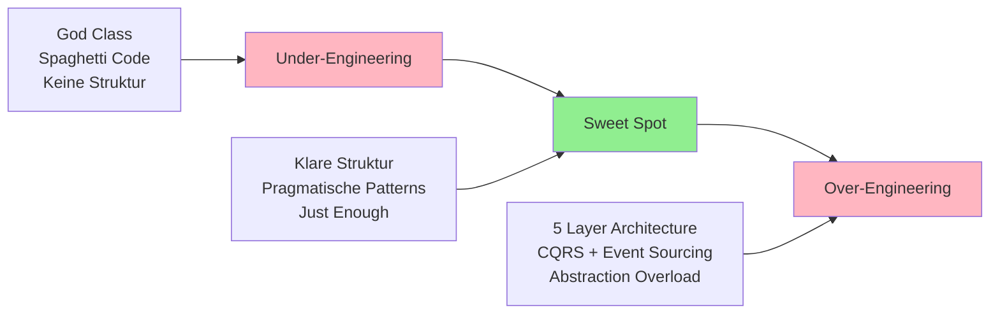
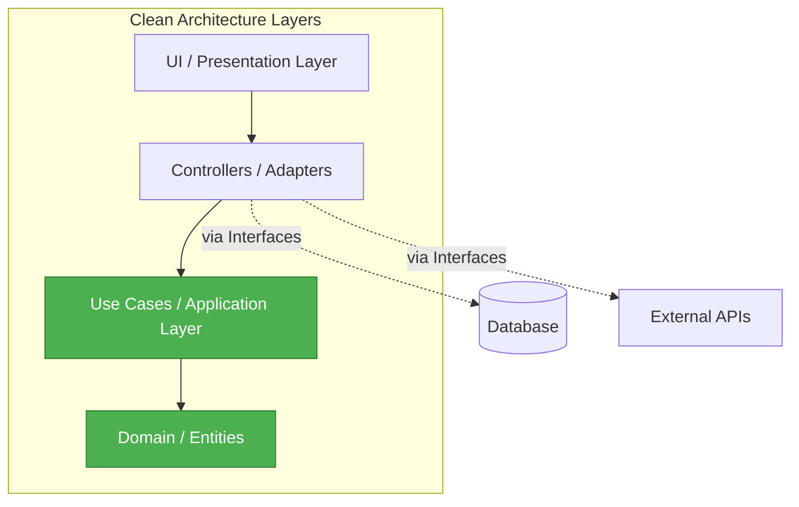
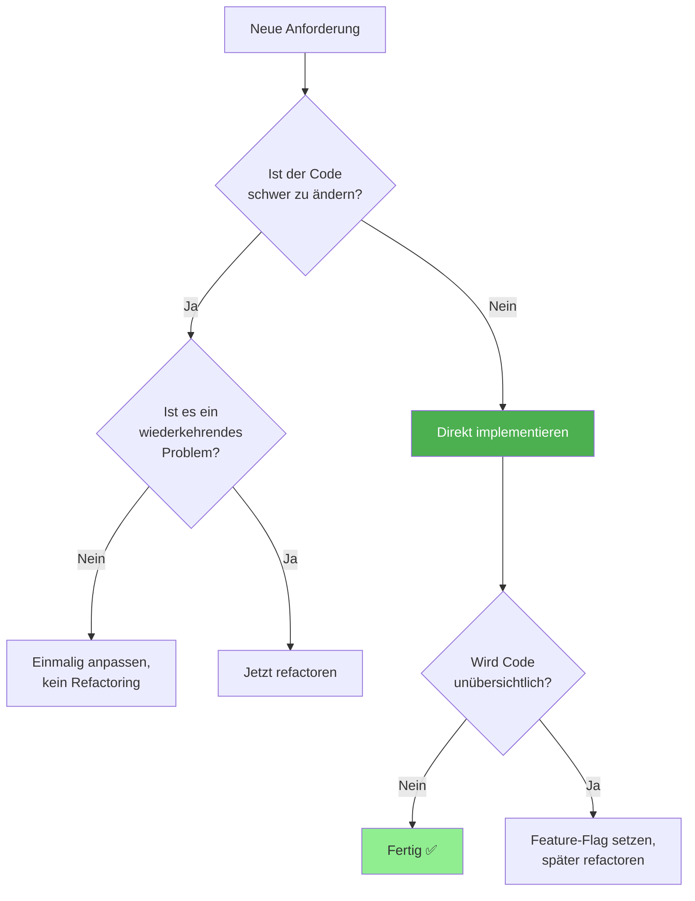
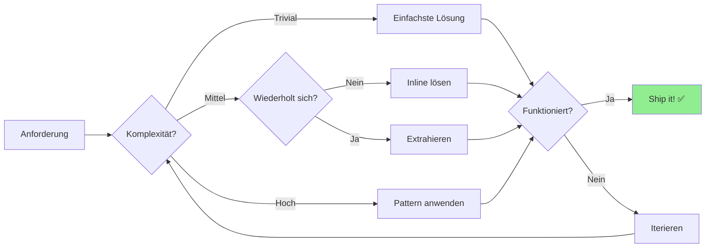

# Kapitel 18: Pragmatische Architektur - Von Clean Architecture bis KISS

## Warum dieses Kapitel existiert

Nach 17 Kapiteln voller Best Practices, Patterns und Framework-Features ist es Zeit für die unbequeme Wahrheit: **Die meisten Architektur-Patterns, die du in Enterprise-Büchern findest, brauchst du nicht.**

Dieses Kapitel ist anders. Es zeigt dir nicht, wie man die perfekte, skalierbare, enterprise-ready Architektur baut. Es zeigt dir, wie du pragmatische Entscheidungen triffst für **reale Projekte mit realen Constraints**.

---

## 18.1 Das Architektur-Dilemma

### Die Versprechen der Enterprise-Patterns

Wenn du Bücher über Software-Architektur liest, begegnest du diesen Konzepten:

```
┌────────────────────────────────────────────────────────────┐
│           Enterprise Architecture Patterns                  │
├────────────────────────────────────────────────────────────┤
│                                                            │
│  • Clean Architecture (Uncle Bob)                          │
│    └─ Dependency Rule, Use Cases, Entities                 │
│                                                            │
│  • Hexagonal Architecture (Ports & Adapters)               │
│    └─ Complete Framework Independence                      │
│                                                            │
│  • CQRS (Command Query Responsibility Segregation)         │
│    └─ Separate Read/Write Models                           │
│                                                            │
│  • Event Sourcing                                          │
│    └─ All State Changes as Events                          │
│                                                            │
│  • Domain-Driven Design (DDD)                              │
│    └─ Aggregates, Value Objects, Repositories              │
│                                                            │
│  • Microservices                                           │
│    └─ Distributed Everything                               │
│                                                            │
└────────────────────────────────────────────────────────────┘
```

**Die Theorie:** Diese Patterns machen deine App:
- ✨ Wartbar
- ✨ Testbar
- ✨ Skalierbar
- ✨ Framework-unabhängig
- ✨ Team-freundlich

**Die Realität:** Sie machen deine App oft:
- 🔥 Über-kompliziert
- 🔥 Schwerer zu verstehen
- 🔥 Langsamer zu entwickeln
- 🔥 Anfälliger für Over-Engineering

### Das Over-Engineering-Spektrum



**Dein Ziel:** Der Sweet Spot. So einfach wie möglich, so strukturiert wie nötig.

---

## 18.2 Clean Architecture erklärt

### Was ist Clean Architecture?



**Die Dependency Rule:** Abhängigkeiten zeigen nur nach innen.

```typescript
// ❌ Verboten: Domain abhängig von Framework
// domain/entities/Reading.ts
import { Model } from 'some-orm-framework';

export class Reading extends Model {  // Domain hängt von ORM ab!
  id: number;
  energyKwh: number;
}
```

```typescript
// ✅ Erlaubt: Framework abhängig von Domain
// domain/entities/Reading.ts
export class Reading {  // Pure Business Logic, keine Dependencies
  constructor(
    public id: number,
    public energyKwh: number
  ) {
    if (energyKwh < 0) {
      throw new Error('Energy cannot be negative');
    }
  }

  calculateCost(pricePerKwh: number): number {
    return this.energyKwh * pricePerKwh;
  }
}

// infrastructure/orm/ReadingMapper.ts
import { Reading } from '../../domain/entities/Reading';

export class ReadingMapper {  // Infrastructure hängt von Domain ab
  toDomain(dbRow: any): Reading {
    return new Reading(dbRow.id, dbRow.energy_kwh);
  }
}
```

### Vollständiges Clean Architecture Beispiel

```
project/
├── domain/                          # Layer 1: Business Logic (Core)
│   ├── entities/
│   │   ├── Reading.ts               # Pure business entities
│   │   ├── Tariff.ts
│   │   └── Statistics.ts
│   │
│   ├── repositories/                # Interfaces (nicht Implementierungen!)
│   │   ├── IReadingRepository.ts
│   │   └── ITariffRepository.ts
│   │
│   └── services/                    # Domain Services
│       └── PricingService.ts        # Komplexe Business-Logik
│
├── application/                     # Layer 2: Use Cases
│   ├── commands/                    # Write Operations (CQRS)
│   │   ├── AddReadingCommand.ts
│   │   └── UpdateTariffCommand.ts
│   │
│   └── queries/                     # Read Operations (CQRS)
│       ├── GetReadingsQuery.ts
│       └── GetStatisticsQuery.ts
│
├── infrastructure/                  # Layer 3: Framework & External
│   ├── database/
│   │   ├── SqliteReadingRepository.ts  # Implementiert IReadingRepository
│   │   └── migrations/
│   │
│   ├── api/
│   │   └── ElwaApiClient.ts
│   │
│   └── scheduler/
│       └── CronScheduler.ts
│
└── presentation/                    # Layer 4: User Interface
    ├── controllers/
    │   └── ReadingController.ts     # Express Routes
    │
    └── views/
        └── react-app/               # Frontend
```

**Ein Use Case im Detail:**

```typescript
// application/commands/AddReadingCommand.ts
import { Reading } from '../../domain/entities/Reading';
import { IReadingRepository } from '../../domain/repositories/IReadingRepository';
import { IEventBus } from '../events/IEventBus';

export class AddReadingCommand {
  constructor(
    private readingRepo: IReadingRepository,  // Interface, nicht konkrete Implementierung!
    private eventBus: IEventBus
  ) {}

  async execute(data: { date: string; energyKwh: number }): Promise<Reading> {
    // 1. Validierung
    if (data.energyKwh < 0) {
      throw new Error('Energy cannot be negative');
    }

    // 2. Domain Logic
    const reading = new Reading(0, data.date, data.energyKwh);

    // 3. Persistence (via Interface)
    const saved = await this.readingRepo.save(reading);

    // 4. Event publishen
    await this.eventBus.publish({
      type: 'READING_ADDED',
      payload: saved
    });

    return saved;
  }
}

// infrastructure/database/SqliteReadingRepository.ts
import { IReadingRepository } from '../../domain/repositories/IReadingRepository';
import { Reading } from '../../domain/entities/Reading';
import db from './connection';

export class SqliteReadingRepository implements IReadingRepository {
  async save(reading: Reading): Promise<Reading> {
    const stmt = db.prepare('INSERT INTO readings (date, energyKwh) VALUES (?, ?)');
    const result = stmt.run(reading.date, reading.energyKwh);
    return new Reading(result.lastInsertRowid, reading.date, reading.energyKwh);
  }

  async findById(id: number): Promise<Reading | null> {
    const row = db.prepare('SELECT * FROM readings WHERE id = ?').get(id);
    return row ? new Reading(row.id, row.date, row.energyKwh) : null;
  }
}

// presentation/controllers/ReadingController.ts
import { AddReadingCommand } from '../../application/commands/AddReadingCommand';
import { Router } from 'express';

export function createReadingController(addReading: AddReadingCommand) {
  const router = Router();

  router.post('/readings', async (req, res) => {
    try {
      const reading = await addReading.execute(req.body);
      res.json(reading);
    } catch (error) {
      res.status(400).json({ error: error.message });
    }
  });

  return router;
}

// main.ts - Dependency Injection
const readingRepo = new SqliteReadingRepository();
const eventBus = new InMemoryEventBus();
const addReadingCommand = new AddReadingCommand(readingRepo, eventBus);
const readingController = createReadingController(addReadingCommand);

app.use('/api', readingController);
```

**Vorteile:**
- ✅ Business Logic testbar ohne DB
- ✅ Einfacher Wechsel von SQLite zu PostgreSQL
- ✅ Klare Verantwortlichkeiten

**Nachteile:**
- ❌ Viel Boilerplate (Interfaces, Commands, Repositories)
- ❌ Mehr Dateien für einfache Operations
- ❌ Komplexer für neue Entwickler

---

## 18.3 Die React/Node.js Reality

### Was ist in der Community üblich?

**Kleine bis mittlere React Apps:**

```typescript
// ✅ DAS macht die Community:
// src/pages/Readings.tsx
function ReadingsPage() {
  const [readings, setReadings] = useState([]);

  useEffect(() => {
    fetch('/api/readings')
      .then(r => r.json())
      .then(setReadings);
  }, []);

  return <div>{readings.map(r => <ReadingCard key={r.id} reading={r} />)}</div>;
}

// server/routes/readings.js
app.get('/api/readings', (req, res) => {
  const readings = db.prepare('SELECT * FROM readings').all();
  res.json(readings);
});
```

**Das ist NICHT unter-engineered. Das ist idiomatisch!**

### Framework-Native Patterns

**Next.js** hat seinen eigenen "Architecture"-Ansatz:

```typescript
// app/readings/page.tsx - Server Component
import { db } from '@/lib/db';

export default async function ReadingsPage() {
  // Direkter DB-Zugriff im Component - KEIN Anti-Pattern in Next.js!
  const readings = await db.query.readings.findMany();

  return (
    <div>
      {readings.map(r => <ReadingCard key={r.id} reading={r} />)}
    </div>
  );
}

// Server Actions - Business Logic IN THE COMPONENT
export async function addReading(formData: FormData) {
  'use server';

  const energyKwh = Number(formData.get('energyKwh'));
  await db.insert(readings).values({ energyKwh });
  revalidatePath('/readings');
}
```

**tRPC** eliminiert die API-Layer komplett:

```typescript
// server/routers/readings.ts
export const readingsRouter = router({
  getAll: publicProcedure.query(() => {
    return db.query.readings.findMany();  // Direkt im Router
  }),

  add: publicProcedure
    .input(z.object({ energyKwh: z.number() }))
    .mutation(({ input }) => {
      return db.insert(readings).values(input);
    }),
});

// Frontend - typsicher ohne API-Schicht
function Readings() {
  const { data } = trpc.readings.getAll.useQuery();  // Kein fetch!
  const addReading = trpc.readings.add.useMutation();

  return <div>...</div>;
}
```

**Ist das "schlechte Architektur"? NEIN. Es ist framework-idiomatisch!**

---

## 18.4 HausTracker: Die Pragmatische Evolution

### Phase 1: MVP (Minimum Viable Product)

**Das erste was funktioniert:**

```typescript
// ALLES in einer Datei - 200 Zeilen
// server.ts
import express from 'express';
import Database from 'better-sqlite3';

const app = express();
const db = new Database('haustracker.db');

db.exec(`
  CREATE TABLE IF NOT EXISTS readings (
    id INTEGER PRIMARY KEY,
    date TEXT,
    energyKwh REAL
  )
`);

app.get('/api/readings', (req, res) => {
  const readings = db.prepare('SELECT * FROM readings').all();
  res.json(readings);
});

app.post('/api/readings', (req, res) => {
  const { date, energyKwh } = req.body;
  const stmt = db.prepare('INSERT INTO readings (date, energyKwh) VALUES (?, ?)');
  const result = stmt.run(date, energyKwh);
  res.json({ id: result.lastInsertRowid });
});

app.listen(3001);
```

**Ist das schlechte Architektur? NEIN. Es ist ein MVP!**

### Phase 2: Erste Refactorings

**Wenn die Datei zu groß wird (>500 Zeilen):**

```
server/
├── index.ts         # Setup & Middleware
├── db.ts            # Database Connection
└── routes.ts        # Alle Routes
```

```typescript
// db.ts
import Database from 'better-sqlite3';

export const db = new Database('haustracker.db');

// routes.ts
import { Router } from 'express';
import { db } from './db';

const router = Router();

router.get('/readings', (req, res) => {
  const readings = db.prepare('SELECT * FROM readings').all();
  res.json(readings);
});

export default router;

// index.ts
import express from 'express';
import routes from './routes';

const app = express();
app.use('/api', routes);
app.listen(3001);
```

### Phase 3: Feature-basierte Organisation

**Wenn mehrere Features existieren:**

```
server/
├── src/
│   ├── routes/              # Eine Datei pro Resource
│   │   ├── readings.routes.ts
│   │   ├── tariffs.routes.ts
│   │   └── elwa.routes.ts
│   │
│   ├── db.ts
│   ├── elwa-client.ts       # Externe API-Client
│   ├── elwa-scheduler.ts    # Business Logic für Scheduler
│   └── index.ts
```

```typescript
// routes/readings.routes.ts
import { Router } from 'express';
import db from '../db';

const router = Router();

// Helper functions (privat für diesen Router)
function calculateConsumption(current: number, previous: number) {
  return current - previous;
}

// Routes
router.get('/', (req, res) => {
  const readings = db.prepare('SELECT * FROM readings ORDER BY date DESC').all();
  res.json(readings);
});

router.post('/', (req, res) => {
  const { date, energyKwh } = req.body;

  // Validation
  if (!date || energyKwh == null) {
    return res.status(400).json({ error: 'Missing required fields' });
  }

  // Business Logic
  const previous = db.prepare('SELECT * FROM readings WHERE date < ? ORDER BY date DESC LIMIT 1')
    .get(date);

  const consumption = previous ? calculateConsumption(energyKwh, previous.energyKwh) : 0;

  // Persistence
  const stmt = db.prepare('INSERT INTO readings (date, energyKwh, consumption) VALUES (?, ?, ?)');
  const result = stmt.run(date, energyKwh, consumption);

  res.json({ id: result.lastInsertRowid });
});

export default router;
```

**Das ist GENUG Struktur für eine App mit <10k LOC!**

### Phase 4: Custom Hooks (Frontend)

**Wenn API-Calls überall verstreut sind:**

```
src/
├── hooks/                   # Wiederverwendbare Logik
│   ├── useReadings.ts
│   ├── useTariffs.ts
│   └── useElwa.ts
│
└── pages/
    └── Readings.tsx
```

```typescript
// hooks/useReadings.ts
import { useState, useEffect } from 'react';

export function useReadings() {
  const [readings, setReadings] = useState([]);
  const [loading, setLoading] = useState(true);
  const [error, setError] = useState(null);

  const fetchReadings = async () => {
    try {
      setLoading(true);
      const response = await fetch('/api/readings');
      const data = await response.json();
      setReadings(data);
    } catch (err) {
      setError(err.message);
    } finally {
      setLoading(false);
    }
  };

  useEffect(() => {
    fetchReadings();
  }, []);

  const addReading = async (reading) => {
    await fetch('/api/readings', {
      method: 'POST',
      headers: { 'Content-Type': 'application/json' },
      body: JSON.stringify(reading),
    });
    await fetchReadings();  // Auto-refresh
  };

  return {
    readings,
    loading,
    error,
    addReading,
    refresh: fetchReadings,
  };
}

// pages/Readings.tsx - VIEL einfacher!
function ReadingsPage() {
  const { readings, loading, error, addReading } = useReadings();

  if (loading) return <Spinner />;
  if (error) return <Error message={error} />;

  return (
    <div>
      {readings.map(r => <ReadingCard key={r.id} reading={r} />)}
      <AddReadingForm onSubmit={addReading} />
    </div>
  );
}
```

### Wann NICHT weiter refactoren



**Die "Rule of Three" (Martin Fowler):**
> Code erst beim **dritten** Mal extrahieren, nicht beim ersten.

```typescript
// 1. Mal: Direkt im Component
function UserProfile() {
  const [user, setUser] = useState(null);
  useEffect(() => {
    fetch('/api/user').then(r => r.json()).then(setUser);
  }, []);
}

// 2. Mal: Copy-Paste (ja, wirklich!)
function UserSettings() {
  const [user, setUser] = useState(null);
  useEffect(() => {
    fetch('/api/user').then(r => r.json()).then(setUser);
  }, []);
}

// 3. Mal: JETZT extrahieren
function useUser() {
  const [user, setUser] = useState(null);
  useEffect(() => {
    fetch('/api/user').then(r => r.json()).then(setUser);
  }, []);
  return user;
}
```

---

## 18.5 Alternativen zu Clean Architecture

### Option 1: Vertical Slice Architecture

Statt horizontale Layer (UI, Business, Data), organisiere nach Features:

```
src/
├── features/
│   ├── readings/
│   │   ├── AddReading.tsx          # UI
│   │   ├── ReadingsList.tsx
│   │   ├── readings.api.ts         # API Client
│   │   ├── readings.hooks.ts       # Hooks
│   │   └── readings.types.ts       # Types
│   │
│   ├── tariffs/
│   │   ├── TariffManager.tsx
│   │   ├── tariffs.api.ts
│   │   └── tariffs.types.ts
│   │
│   └── elwa/
│       ├── ElwaStats.tsx
│       ├── elwa.api.ts
│       └── elwa.scheduler.ts       # Auch Backend-Code!
│
└── shared/
    ├── components/
    └── utils/
```

**Vorteile:**
- ✅ Alles für ein Feature an einem Ort
- ✅ Einfacher Features zu entfernen
- ✅ Teams können parallel arbeiten

**Nachteile:**
- ❌ Code-Duplizierung zwischen Features
- ❌ Schwieriger gemeinsame Logik zu finden

### Option 2: Screaming Architecture

Die Ordnerstruktur schreit dir entgegen, WAS die App macht (nicht WIE):

```
src/
├── Fernwaerme/
│   ├── ZaehlerstandErfassen/
│   ├── TarifVerwaltung/
│   └── Kostenberechnung/
│
├── ELWA/
│   ├── CloudImport/
│   ├── Statistiken/
│   └── Scheduler/
│
└── Dashboard/
    └── Uebersicht/
```

Statt:
```
src/
├── components/
├── hooks/
├── services/
└── utils/
```

### Option 3: Framework-First

Nutze was das Framework gibt:

**Next.js App Router:**
```
app/
├── (dashboard)/
│   ├── layout.tsx
│   └── page.tsx
│
├── readings/
│   ├── page.tsx              # Server Component mit DB-Access
│   └── actions.ts            # Server Actions
│
└── api/
    └── webhooks/
        └── route.ts          # Nur für Webhooks
```

**Remix:**
```
app/
├── routes/
│   ├── _index.tsx
│   ├── readings.tsx          # Loader + Action + Component
│   └── readings.$id.tsx
│
└── models/
    └── reading.server.ts     # DB-Queries
```

---

## 18.6 Die Architektur-Entscheidungsmatrix

```
┌───────────────────────────────────────────────────────────────────┐
│                   Wann welche Architektur?                        │
├───────────────────────────────────────────────────────────────────┤
│                                                                   │
│  Team Size        │  LOC      │  Recommendation                   │
│  ─────────────────┼───────────┼───────────────────────────────── │
│  1 Entwickler     │  <5k      │  Alles in wenigen Dateien        │
│  1 Entwickler     │  5k-20k   │  Feature-basierte Organization    │
│  1 Entwickler     │  >20k     │  Vertical Slices                 │
│  ─────────────────┼───────────┼───────────────────────────────── │
│  2-5 Entwickler   │  <10k     │  Einfache Folder-Struktur        │
│  2-5 Entwickler   │  10k-50k  │  Vertical Slices + Custom Hooks  │
│  2-5 Entwickler   │  >50k     │  Service Layer + DDD light       │
│  ─────────────────┼───────────┼───────────────────────────────── │
│  >10 Entwickler   │  any      │  Clean Architecture + DDD        │
│  ─────────────────┼───────────┼───────────────────────────────── │
│                                                                   │
│  Special Cases:                                                   │
│  • Banking, Healthcare    → Clean Arch (Testing critical)         │
│  • Startup MVP           → Alles in index.ts (Speed critical)     │
│  • Monorepo             → Vertical Slices (Team autonomy)         │
│  • Microservices        → Service per Repo (Independence)         │
│                                                                   │
└───────────────────────────────────────────────────────────────────┘
```

---

## 18.7 HausTracker: Die finalen Architektur-Entscheidungen

### Was wir HABEN

```
haustracker/
├── src/                     # Frontend
│   ├── components/          # UI Components
│   ├── pages/               # Page Components
│   ├── hooks/               # Custom Hooks ⭐
│   │   ├── useReadings.ts
│   │   ├── useTariffs.ts
│   │   ├── useSettings.ts
│   │   └── useElwa.ts
│   └── main.tsx
│
└── server/
    ├── src/
    │   ├── routes/          # Feature-based Routes ⭐
    │   │   ├── readings.routes.ts
    │   │   ├── tariffs.routes.ts
    │   │   ├── elwa.routes.ts
    │   │   └── settings.routes.ts
    │   │
    │   ├── db.ts            # DB Connection
    │   ├── elwa-client.ts   # External API Client
    │   ├── elwa-scheduler.ts
    │   └── index.ts         # Server Setup
    │
    └── data/
        └── haustracker.db
```

**Architektur-Level: Pragmatisch strukturiert**
- ✅ Genug Trennung für Wartbarkeit
- ✅ Nicht zu viel Abstraktion
- ✅ Einfach für eine Person zu verstehen
- ✅ Einfach zu erweitern

### Was wir NICHT haben (und nicht brauchen)

```
❌ Nicht vorhanden:
├── domain/
│   ├── entities/
│   ├── repositories/        # Repository Pattern
│   └── services/
│
├── application/
│   ├── commands/            # CQRS
│   └── queries/
│
├── infrastructure/
│   └── orm/
│
└── tests/
    ├── unit/
    ├── integration/
    └── e2e/
```

**Warum nicht?**
- App ist <5k LOC
- 1 Entwickler
- Lokale Anwendung (keine Skalierung nötig)
- SQLite (kein ORM-Wechsel geplant)
- Business Logic ist einfach (kein DDD nötig)

### Die Upgrade-Pfade

**Wenn die App wächst, können wir:**

1. **React Query hinzufügen** (Caching-Layer)
   ```typescript
   // hooks/useReadings.ts - mit React Query
   import { useQuery, useMutation } from '@tanstack/react-query';

   export function useReadings() {
     return useQuery({
       queryKey: ['readings'],
       queryFn: () => fetch('/api/readings').then(r => r.json()),
       staleTime: 5 * 60 * 1000,  // 5 min cache
     });
   }
   ```

2. **Service Layer extrahieren** (wenn Business Logic komplex wird)
   ```typescript
   // server/services/reading.service.ts
   export class ReadingService {
     calculateConsumption(current, previous) { ... }
     calculateCosts(reading, tariff) { ... }
     generateReport(startDate, endDate) { ... }
   }

   // routes/readings.routes.ts
   const readingService = new ReadingService();
   router.post('/', (req, res) => {
     const result = readingService.process(req.body);
     res.json(result);
   });
   ```

3. **Zu Next.js migrieren** (wenn SSR nötig wird)
4. **Microservices** (wenn Team >10 Entwickler)

**Aber NUR wenn nötig! Nicht prophylaktisch!**

---

## 18.8 Best Practices vs. Pragmatismus

### Die Balance finden



### Das Pragmatismus-Manifest

```
┌────────────────────────────────────────────────────────────┐
│           Pragmatic Architecture Principles                │
├────────────────────────────────────────────────────────────┤
│                                                            │
│  1. Working Code > Perfect Architecture                    │
│     └─ Lieber shippable als "sauber"                       │
│                                                            │
│  2. YAGNI (You Ain't Gonna Need It)                        │
│     └─ Features die vielleicht gebraucht werden = Ballast  │
│                                                            │
│  3. Rule of Three                                          │
│     └─ Erst beim 3. Mal abstrahieren                       │
│                                                            │
│  4. Optimiere für Lesbarkeit, nicht Flexibilität           │
│     └─ 6 Monate später liest du deinen Code wie Fremder    │
│                                                            │
│  5. Kontext > Dogma                                        │
│     └─ 1-Mann-Startup ≠ 100-Dev-Enterprise                  │
│                                                            │
│  6. Refactor when you touch it                            │
│     └─ Nicht alles auf einmal, schrittweise verbessern     │
│                                                            │
│  7. Monolith first, then split                             │
│     └─ Verteilte Systeme sind 10x komplexer                │
│                                                            │
│  8. Standard Tools > Custom Solutions                      │
│     └─ Express + SQLite schlägt custom Framework           │
│                                                            │
└────────────────────────────────────────────────────────────┘
```

### Code-Beispiele: Best Practice vs. Pragmatisch

**Best Practice (aus Lehrbuch):**
```typescript
// ❌ Over-engineered für einfache CRUD

// domain/entities/Reading.ts
export class Reading {
  constructor(
    private _id: number,
    private _energyKwh: number
  ) {}

  get id() { return this._id; }
  get energyKwh() { return this._energyKwh; }

  validate(): ValidationResult { ... }
  toDomain(): ReadingDomain { ... }
}

// domain/repositories/IReadingRepository.ts
export interface IReadingRepository {
  findById(id: number): Promise<Reading>;
  save(reading: Reading): Promise<void>;
}

// infrastructure/SqliteReadingRepository.ts
export class SqliteReadingRepository implements IReadingRepository {
  async findById(id: number): Promise<Reading> {
    const row = db.prepare('SELECT * FROM readings WHERE id = ?').get(id);
    return ReadingMapper.toDomain(row);
  }
}

// application/commands/GetReadingQuery.ts
export class GetReadingQuery {
  constructor(private repo: IReadingRepository) {}

  async execute(id: number): Promise<ReadingDTO> {
    const reading = await this.repo.findById(id);
    return ReadingMapper.toDTO(reading);
  }
}

// presentation/ReadingController.ts
export class ReadingController {
  constructor(private getReading: GetReadingQuery) {}

  async get(req, res) {
    const reading = await this.getReading.execute(req.params.id);
    res.json(reading);
  }
}
```

**Pragmatisch (HausTracker):**
```typescript
// ✅ Just enough architecture

// routes/readings.routes.ts
import { Router } from 'express';
import db from '../db';

const router = Router();

router.get('/:id', (req, res) => {
  const reading = db.prepare('SELECT * FROM readings WHERE id = ?').get(req.params.id);

  if (!reading) {
    return res.status(404).json({ error: 'Not found' });
  }

  res.json(reading);
});

export default router;
```

**4 Dateien vs. 1 Datei. Gleiches Resultat.**

---

## 18.9 Zusammenfassung

### Die wichtigsten Erkenntnisse

1. **Clean Architecture ist nicht falsch, aber oft overkill**
   - Für große Teams (>10 Entwickler) sinnvoll
   - Für kleine Teams meist zu viel Overhead

2. **React/Node.js haben ihre eigenen Patterns**
   - Custom Hooks sind "Architektur" im React-Kontext
   - Server Components in Next.js eliminieren API-Layer
   - tRPC macht Repository-Pattern obsolet

3. **Kontext entscheidet**
   - Startup MVP: Alles in wenigen Dateien
   - Scale-Up: Schrittweise Struktur hinzufügen
   - Enterprise: Vollständige Layering

4. **HausTracker ist pragmatisch strukturiert**
   - Custom Hooks (Frontend-Organisation)
   - Feature-based Routes (Backend-Organisation)
   - Kein Over-Engineering
   - Einfach zu erweitern

### Der Architektur-Kompass

```
Wann Clean Architecture?
├─ Team >10 Entwickler → JA
├─ Komplexe Business-Logik → JA
├─ Häufige Framework-Wechsel → JA
├─ Banking/Healthcare → JA
└─ Alles andere → Pragmatisch starten

Wann Custom Hooks?
├─ API-Calls wiederholt → JA
├─ Komplexe State-Logik → JA
├─ Testability wichtig → JA
└─ Einmaliger Code → NEIN

Wann Service Layer?
├─ Business-Logik >100 Zeilen → JA
├─ Wiederverwendung nötig → JA
├─ Controller zu fett → JA
└─ Einfache CRUD → NEIN
```

### Deine Leitfragen

Bevor du ein Pattern implementierst, frage dich:

1. **Löst es ein AKTUELLES Problem oder ein hypothetisches?**
2. **Macht es den Code leichter zu verstehen oder komplexer?**
3. **Würde ein Junior-Dev das nach 6 Monaten noch verstehen?**
4. **Ist es idiomatisch für das Framework das ich nutze?**
5. **Kann ich es in 5 Minuten jemandem erklären?**

**Wenn ≥3 Fragen mit NEIN beantwortet werden: Don't do it.**

---

## Weiterführende Ressourcen

**Bücher:**
- "A Philosophy of Software Design" - John Ousterhout (Pro-Simplicity)
- "Clean Architecture" - Robert C. Martin (Pro-Architecture)
- "Domain-Driven Design Distilled" - Vaughn Vernon (DDD light)

**Blog-Posts:**
- "Write code that is easy to delete, not easy to extend" - tef
- "The Wrong Abstraction" - Sandi Metz
- "Goodbye, Clean Code" - Dan Abramov (React-Kontext)

**Videos:**
- "Simple Made Easy" - Rich Hickey
- "The Art of Code" - Dylan Beattie

---

Im nächsten Kapitel... ach nein, das war's! Du hast jetzt alle Tools um pragmatische Architektur-Entscheidungen zu treffen. Go build something awesome! 🚀
